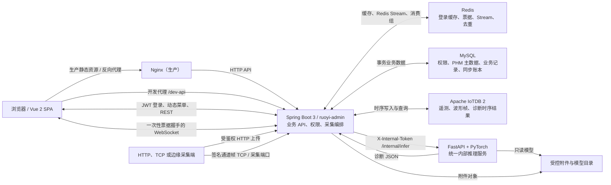
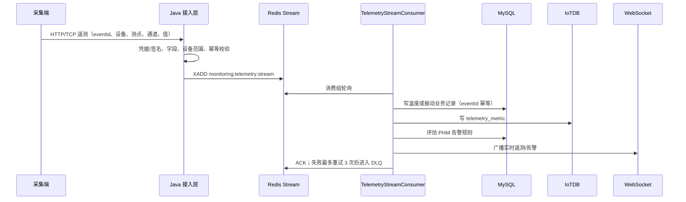
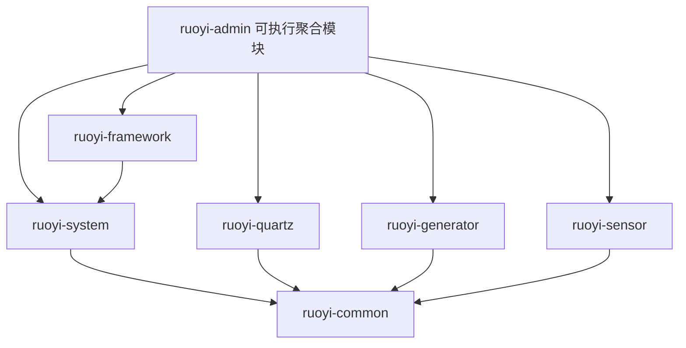

# 项目总览（面向 AI 编程代理）

> 本文是本仓库的代码知识地图，帮助第一次接触项目的 AI 或开发者快速建立正确上下文。
> 它不是产品宣传页，也不替代具体模块中的实现、配置、迁移和测试。

## 0. 阅读结论与事实边界

### 0.1 一句话定位

本项目是在 **RuoYi-Vue 3.9.2** 权限管理框架上深度改造的工业设备健康管理平台，覆盖设备 PHM、振动/温度/油液监测、多通道采集、时频分析、齿轮与轴承智能诊断、告警闭环、报表及 Windows 离线部署。

它不是原版 RuoYi 的简单换肤。仓库的主要业务增量集中在：

- `ruoyi-sensor`：采集、时序存储、分析、诊断、PHM 领域和实时推送；
- `ruoyi-ui/src/views/phm`、`monitoring-center`、`monitor/diagnosis` 等：工业业务前端；
- `ruoyi-sensor/inference`：独立的内部 Python/FastAPI 推理进程；
- `ruoyi-admin/src/main/java/db/migration`：生产数据库的 Flyway Java 迁移；
- `deployment`、`setup`、根目录 PowerShell：开发、测试和离线交付流程。

### 0.2 本文采用的代码口径

本文档编写时（2026-08-13）的 Git 基线为：

- 分支：`main`；
- `HEAD`：`e723f64`（`chore: remove tracked .env file from git`）；
- 工作区存在大量用户尚未提交的修改和新增文件。

因此本文使用“双口径”：

1. **已提交基线**：`e723f64` 及其历史提交中的稳定能力；
2. **当前工作区**：磁盘上可见、但不一定已经提交或发布的最新能力。

当前工作区演进包括但不限于：诊断结果向 IoTDB 的可靠同步与主读、设备可见性、历史数据下载、推理任务/通道引用、机器大脑首页、油液监测页面及菜单、工业主题重构。后续 AI 不得把这些内容描述成“已合并发布”，也不得因为它们未被 Git 跟踪就删除它们。

开始任何任务前先执行：

```powershell
git status --short
git log -5 --oneline --decorate
```

### 0.3 信息可信度顺序

发现描述冲突时按以下优先级判断：

1. 当前 Java、Vue、Python 实现和实际应用配置；
2. Flyway 版本迁移及测试；
3. `start-all.ps1`、CI、生产打包脚本；
4. `deployment/` 与 `setup/` 中的部署说明；
5. 根目录 `README.md` 和历史 SQL；
6. 日志、构建产物、旧演示文件。

例如，旧文档可能仍写两个 Python 推理端口或公开 `/health`，而当前开发架构是一个仅绑定环回地址的统一 FastAPI 服务（默认 `5000`），接口位于 `/internal/*` 且需要内部令牌。此类冲突必须以当前代码和 `start-all.ps1` 为准。

### 0.4 源码、运行资产和噪声的区分

以下目录/文件不是正常源码修改目标，不应无故扫描全文、格式化或提交：

| 类别 | 路径示例 | 处理原则 |
|---|---|---|
| 构建产物 | `**/target/`、`ruoyi-ui/dist/` | 可重新生成，不手改 |
| 依赖 | `ruoyi-ui/node_modules/`、`.mimocode/node_modules/`、`.venv/` | 不提交、不全量搜索 |
| 本地数据 | `.local-data/` | 附件、上传、日志、PID 等运行状态 |
| 模型制品 | `.local-models/*.pth` | 大文件；由模型清单和 SHA-256 管理 |
| 样本数据 | `target_unlabeled/`、`.mat`、`.npy` | 大体积实验输入，不当作代码 |
| 日志 | 根目录 `*.log`、`.codex-runtime/`、推理目录日志 | 仅排障读取，不编辑/提交 |
| 本地机密 | `.env` | 不读取到文档、不输出、不提交 |
| 历史/演示 | `phm-pages-demo.html`、`outputs/` | 参考材料，不代表运行实现 |

`.env.example` 可以作为变量名称参考，但不得把 `.env` 中的真实数据库密码、JWT 密钥、内部令牌、采集器主密钥或私有路径复制到代码、测试、日志或文档。

---

## 1. 总体架构

### 1.1 运行时组件



浏览器只与 Java 平台交互，不应直接访问 Python 推理服务、MySQL、Redis 或 IoTDB。Java 是认证、授权、数据范围校验、任务编排和持久化的统一边界。

### 1.2 当前开发进程模型

`start-all.ps1` 定义当前本地开发架构：

```text
Vue Dev Server (:80)
    -> Spring Boot (:8080)
        -> FastAPI 统一推理 (:5000，仅 127.0.0.1)
        -> MySQL (:3306)
        -> Redis (:6379)
        -> IoTDB ConfigNode/DataNode (:10710/:6667)
        -> 可选采集监听 (:8888/:8890/:8891/:9000)
```

“三进程架构”指业务应用层的 Vue、Spring Boot、FastAPI；MySQL、Redis 和 IoTDB 是外部基础设施进程。生产环境由 Nginx、WinSW 和独立运行时承载，Java 不应在生产中拉起 Python 子进程。

---

## 2. 关键数据流

### 2.1 登录、JWT、权限和菜单

1. 前端通过 `ruoyi-ui/src/api/login.js` 调用登录接口；验证码和登录逻辑位于 `ruoyi-admin`/`ruoyi-framework`。
2. Spring Security 验证用户，`TokenService` 签发 JWT；Redis 保存登录会话/令牌相关状态。
3. 前端把令牌交给 `ruoyi-ui/src/utils/request.js`，后续 Axios 请求自动携带认证头。
4. `ruoyi-ui/src/permission.js` 是路由守卫：无令牌只允许 `/login`、`/register`；有令牌时先拉取用户、角色和菜单。
5. 后端根据 `sys_menu`、角色和权限生成动态路由，前端 Vuex `GenerateRoutes` 后调用 `router.addRoutes`。
6. Java 业务入口用 `@PreAuthorize("@ss.hasPermi('...')")` 校验权限；PHM 还通过数据范围服务限制用户可见设备。

菜单通常不是只改 `ruoyi-ui/src/router/index.js`。除登录、错误页、首页和少数隐藏详情页外，主要菜单来自数据库。新增业务页面时需同时考虑 Flyway 菜单迁移、权限码、角色授权和前端组件路径。

### 2.2 遥测值采集链路



核心类：

- `TelemetryPipelineService`：入队和事件去重；
- `TelemetryStreamConsumer`：消费、MySQL/IoTDB 持久化、告警评估、WebSocket 广播；
- `DeviceVibrationDataController`、`DeviceTemperatureDataController`：HTTP 接口及兼容前缀；
- `CollectorAccessService`、`SensorCollectorAuthenticationFilter`：采集端认证与访问控制；
- `TimeSeriesStore`：时序存储抽象。

相关 Redis key：

- `monitoring:telemetry:stream`；
- `monitoring:telemetry:dlq`；
- `monitoring:telemetry:event:<eventId>` 去重键。

### 2.3 高采样振动帧与多通道链路

通道帧通过 `ChannelFramePipelineService` 进入独立 Redis Stream：

- 主流：`monitoring:vibration-frame:stream`；
- 死信流：`monitoring:vibration-frame:dlq`；
- 去重键：`monitoring:vibration-frame:id:<frameId>`。

`ChannelFrameStreamConsumer` 消费后调用 `ChannelFrameIngestService`，完成帧解析、波形/特征处理、时序写入和实时展示支持。TCP 服务入口主要是：

- `SensorTcpServer`：当前签名通道帧协议，默认 `8891`；
- `TcpVibrationReceiverService`：历史 TCP 接收器，默认 `8890`；
- Netty 配置端口默认 `9000`；
- `CwruMatReceiver`：开发用 MAT 文件接收，默认 `8888`。

生产默认关闭旧接收器。启用 TCP 时必须遵循 `deployment/TCP-COLLECTOR-PROTOCOL.md` 的帧格式、签名、防重放、网络隔离和缓冲要求，不能仅开放端口。

### 2.4 智能诊断链路

1. 用户从诊断页选择设备、测点、模型及输入，或由文件摄取/批任务发起诊断。
2. Java `VibrationDiagnosisController` 校验权限、设备数据范围、输入根目录和模型参数。
3. Java 通过配置的 `sensor.inference.gear-url` / `bearing-url` 调用统一 FastAPI `/internal/infer`。
4. 请求必须携带 Java 与 Python 共享的内部令牌；Python 默认只绑定 `127.0.0.1`。
5. `inference_service.py` 根据模型类型调用齿轮或轴承推理逻辑，加载 `.local-models` 下经 SHA-256 校验的模型。
6. Java 将结果落入 `enhanced_inference_record`，关联设备、测点、通道、任务、模型版本，并按策略联动告警/设备事件。
7. 结果通过 WebSocket 推送给诊断页；批次状态由批次服务维护。

Python 对外仅提供内部接口：

- `GET /internal/health/live`；
- `GET /internal/health/ready`；
- `GET /internal/metrics`；
- `POST /internal/infer`。

这些接口都受内部令牌保护。不要在 Vue 环境变量中配置 Python 地址，不要让浏览器绕过 Java 直接推理，也不要让 Python 持有 MySQL 凭据或直接写业务库。

### 2.5 诊断结果 MySQL → IoTDB 可靠同步（当前工作区演进）

当前工作区引入了可靠 outbox/账本式同步：

1. 诊断事务写入 `enhanced_inference_record` 时，同事务调用 `DiagnosisIotdbSyncService.enqueue` 写入 `diagnosis_iotdb_sync`。
2. 事务提交后异步尝试写 IoTDB `diagnosis_result` 表。
3. 失败时状态转为 `RETRY`，指数退避，定时任务重新领取；租约避免多个实例重复处理。
4. 状态包括 `PENDING`、`PROCESSING`、`RETRY`、`SYNCED`。
5. `DiagnosisSyncHealthIndicator` 暴露积压、重试和最近同步健康信息。

默认 `sensor.diagnosis.read-mode=iotdb-primary`：

- 正常时从 IoTDB 读取诊断历史，再合并 MySQL 中尚未同步的耐久记录；
- IoTDB 不可用时，`DiagnosisResultReadService` 回退 MySQL；
- 按诊断记录 ID 去重，再按创建时间倒序；
- 查询上限在服务层限制为 5000。

这是“先保证 MySQL 事务耐久，再异步投影到 IoTDB”的设计，不是分布式事务。修改时必须保留同事务入账、提交后触发、可重试、可观测、读合并与降级语义。

### 2.6 PHM 业务闭环

PHM 以设备为聚合上下文，主链路为：

```text
设备/测点配置
  -> 遥测、振动帧和特征
  -> 趋势与实时状态
  -> 规则评估/智能诊断
  -> 告警事件
  -> 确认、处置或忽略
  -> 处理记录与设备大事记
  -> 实时/历史报表和服务报告
```

`PhmDataScopeService` 及查询对象负责设备可见范围。任何按 `deviceId`、`deviceCode` 或测点访问数据的新增接口，都必须在服务端执行数据范围检查，不能只靠前端隐藏菜单。

### 2.7 WebSocket 实时推送

浏览器先调用受保护的 `POST /sensor/ws-ticket` 获取短时一次性票据，再完成 WebSocket 握手。握手同时受允许 Origin 配置约束。主要消息包括：

- 实时遥测与特征；
- 多通道帧/分析更新；
- 告警状态；
- 诊断运行状态和结果。

不要把长期 JWT、内部推理令牌或采集器密钥放进 WebSocket URL。修改消息结构时需同步检查 `SensorWebSocketMessageVo`、广播服务和所有前端消费者。

---

## 3. 技术栈与版本

版本以根 `pom.xml`、`ruoyi-ui/package.json` 和 `ruoyi-sensor/inference/requirements.txt` 为准。

| 层 | 技术 | 当前版本/说明 |
|---|---|---|
| Java | JDK | 17 |
| 后端 | Spring Boot | 3.4.5，Jakarta 体系 |
| 安全 | Spring Security + JWT | JJWT 0.13.0；RuoYi 权限服务 |
| ORM | MyBatis / MyBatis-Plus | starter 3.0.4 / MP 3.5.9 |
| 连接池 | Druid | 1.2.28 |
| 数据迁移 | Flyway | 由 Spring Boot BOM 管理；生产启用 Java 迁移 |
| API 文档 | springdoc-openapi | 2.8.9 |
| 采集网络 | Netty | 4.1.118.Final |
| 信号处理 | JTransforms / Commons Math | 3.1 / 3.6.1 |
| 时序库客户端 | Apache IoTDB Session | 2.0.8，Table 模型 |
| 缓存/队列 | Redis / Spring Data Redis | 会话、缓存、Stream、去重、票据 |
| 可观测性 | Actuator、Micrometer、Prometheus | 生产管理端口独立 |
| 前端 | Vue | 2.6.12 |
| 路由/状态 | Vue Router / Vuex | 3.4.9 / 3.6.0 |
| UI | Element UI | 2.15.14 |
| 图表 | ECharts | 5.4.0 |
| 构建 | Vue CLI / Webpack 4 | `@vue/cli-service` 4.4.6 |
| E2E | Playwright | package 声明 `^1.61.0` |
| 推理 API | FastAPI / Uvicorn | 0.115.12 / 0.34.2 |
| 数值与模型 | NumPy / SciPy / PyTorch | 2.2.5 / 1.15.2 / 2.6.0 |
| Python 测试 | pytest | 8.3.5 |

前端 `package.json` 的宽松 `engines` 是历史遗留，不代表现代依赖真的适合 Node 8。复现环境优先使用项目当前锁文件、CI 或团队约定的 Node LTS，并用 `npm ci`。

---

## 4. 仓库与 Maven 模块导航

### 4.1 顶层目录

| 路径 | 职责 |
|---|---|
| `ruoyi-admin` | 可执行 Spring Boot 应用、通用控制器、配置、Flyway 迁移 |
| `ruoyi-common` | 公共常量、注解、异常、工具、基础实体、统一返回结构 |
| `ruoyi-framework` | Security、JWT、数据范围切面、Web 配置、Redis、线程池、异常处理 |
| `ruoyi-system` | 用户、角色、部门、菜单、字典、配置、通知、日志等系统领域 |
| `ruoyi-quartz` | Quartz 任务和调度日志 |
| `ruoyi-generator` | 数据库表代码生成器和 Velocity 模板 |
| `ruoyi-sensor` | 工业采集、监测、分析、诊断、PHM、IoTDB、WebSocket |
| `ruoyi-ui` | Vue 2 单页应用 |
| `sql` | 空库基线、历史升级脚本和迁移说明；不是生产升级主入口 |
| `deployment` | 离线包、WinSW、Nginx、监控、备份恢复和 TCP 协议 |
| `setup` | Windows 环境准备、部署指南和业务冒烟脚本 |
| `deploy` | 简化的 Nginx 示例 |

### 4.2 Maven 依赖方向



模块职责细分：

- **`ruoyi-admin`**：`RuoYiApplication` 是入口；打包后的 `ruoyi-admin.jar` 包含其他模块。系统类 REST 控制器位于 `com.ruoyi.web.controller`。生产配置验证器和 Flyway Java 迁移也在这里。
- **`ruoyi-common`**：包含 `AjaxResult`、`TableDataInfo`、`BaseEntity`、权限/日志注解、通用字符串/日期/文件/Excel 工具。跨模块 DTO 前先判断是否真是通用概念，避免把 PHM 领域类塞入 common。
- **`ruoyi-framework`**：基础设施胶水。重点包括 `SecurityConfig`、`JwtAuthenticationTokenFilter`、`SensorCollectorAuthenticationFilter`、`DataScopeAspect`、`GlobalExceptionHandler`、`TokenService`。
- **`ruoyi-system`**：系统主数据和权限体系；MyBatis 接口与 XML 同时存在，改字段需同步实体、Mapper 接口、XML、服务和前端。
- **`ruoyi-quartz`**：定时任务管理，区别于 `ruoyi-sensor` 内用 `@Scheduled` 实现的内部消费者/重试任务。
- **`ruoyi-generator`**：生成普通 CRUD 的辅助模块。复杂 PHM 聚合、时序查询和采集链路不适合直接照搬生成代码。
- **`ruoyi-sensor`**：业务核心。依赖 common，并由 admin 聚合；其 Controller 会被 admin 的组件扫描加载。

### 4.3 `ruoyi-sensor` 内部结构

```text
com.ruoyi.sensor
├─ config/             异步执行器、WebSocket、兼容 API 过滤器
├─ domain/
│  ├─ dto/             采集/请求传输对象
│  ├─ entity/          MyBatis-Plus 持久化实体
│  ├─ query/           数据范围等查询条件
│  └─ vo/              页面和实时消息视图对象
├─ mapper/             Mapper 接口；部分 SQL 在 resources/mapper
├─ service/
│  ├─ impl/            传统服务实现和 TCP 服务
│  ├─ support/         策略/辅助逻辑
│  └─ timeseries/      IoTDB/Noop 抽象与时序快照
├─ web/                `/sensor`、`/monitoring`、`/phm` 控制器
└─ websocket/          握手拦截与消息处理
```

高价值入口：

| 关注点 | 主要入口 |
|---|---|
| PHM 聚合 API | `web/PhmController.java`、`service/PhmService.java`、`service/impl/PhmServiceImpl.java` |
| 设备数据范围 | `service/PhmDataScopeService.java`、`domain/query/PhmDeviceScopeQuery.java` |
| 振动/温度接口 | `web/DeviceVibrationDataController.java`、`DeviceTemperatureDataController.java` |
| 监测总览 | `web/IndustrialMonitoringController.java`、`service/IndustrialMonitoringService.java` |
| 诊断编排 | `web/VibrationDiagnosisController.java` |
| 批诊断 | `web/VibrationBatchController.java`、`service/DiagnosisBatchService.java` |
| 模型发布 | `web/ModelReleaseController.java` |
| 遥测 Stream | `TelemetryPipelineService.java`、`TelemetryStreamConsumer.java` |
| 通道帧 Stream | `ChannelFramePipelineService.java`、`ChannelFrameStreamConsumer.java` |
| 时序存储 | `service/timeseries/TimeSeriesStore.java`、`IoTdbTimeSeriesStore.java`、`NoopTimeSeriesStore.java` |
| 诊断同步/读取 | `DiagnosisIotdbSyncService.java`、`DiagnosisResultReadService.java` |
| 附件 | `PhmAttachmentStorageService.java`、`AttachmentVirusScanner.java` |
| 实时推送 | `SensorWebSocketPushService.java`、`websocket/SensorWebSocketHandler.java` |
| TCP 采集 | `service/impl/SensorTcpServer.java`、`TcpVibrationReceiverService.java` |

### 4.4 前端结构

| 路径 | 作用 |
|---|---|
| `src/main.js` | Vue、插件、权限守卫和全局样式入口 |
| `src/router/index.js` | 常量路由和少量需权限的隐藏动态路由 |
| `src/permission.js` | 登录检查、用户信息拉取和动态菜单安装 |
| `src/store` | 用户、权限、设置、标签页等 Vuex 状态 |
| `src/utils/request.js` | Axios、JWT、统一错误和下载处理 |
| `src/api` | 后端接口薄封装；不要在页面重复拼 URL |
| `src/views` | 页面级组件 |
| `src/components/IndustrialMonitoring` | 设备导航、上下文栏、测点卡片、状态栏、时间选择等复用组件 |
| `src/assets/styles/industrial-theme.scss` | 当前工作区统一工业主题入口 |
| `src/layout` | 整体布局、导航栏、设置面板和主内容容器 |

主要业务页面：

- `views/phm/cluster`：设备集群；
- `views/phm/brain`：机器大脑/设备详情；
- `views/phm/alarms`：告警中心；
- `views/phm/events`：设备大事记；
- `views/phm/reports`：实时报表、历史报表和服务报告；
- `views/phm/config`：设备、测点、规则、特征和展示配置；
- `views/monitor/diagnosis`：诊断工作台和测点总览；
- `views/monitoring-center`：工业监测中心；
- `views/monitoring-center/oil`：当前工作区新增油液监测；
- `views/system/vibration`：振动、批次、多通道监控；
- `views/system/temperature`：温度监控。

主要 API 封装：

- `src/api/phm.js`：PHM 聚合接口；
- `src/api/system/bearingDiagnosis.js`：诊断、模型、批次和历史；
- `src/api/system/vibration.js`、`temperature.js`：传感器数据；
- `src/api/monitoring.js`：监测总览；
- `src/api/oilMonitoring.js`：当前工作区油液接口。

---

## 5. 业务能力地图

### 5.1 RuoYi 基础平台

- 用户、角色、岗位、部门与数据权限；
- 菜单、动态路由与按钮权限；
- 字典、参数配置、通知公告；
- 登录日志、操作日志、在线用户、服务器和缓存监控；
- Quartz 任务调度；
- Swagger/OpenAPI 与代码生成器；
- Excel 导入导出和通用文件下载。

### 5.2 工业监测

- 振动和温度数据接入、查询、趋势展示；
- 多设备、多测点、多通道实时状态；
- RMS、峰值等特征及 FFT/频谱分析；
- Redis Stream 异步削峰、幂等、重试和死信；
- IoTDB 时序数据、原始波形帧和不同数据类型 TTL；
- WebSocket 实时特征、帧、告警和分析结果；
- 当前工作区中的油液指标、趋势和颗粒分布页面。

### 5.3 PHM

- 设备集群、健康状态、关注设备和设备可见范围；
- 设备电子铭牌、工况参数、测点卡片和健康趋势；
- 测点、特征、告警规则和系统展示配置；
- 告警产生、确认、处置、忽略、恢复和处理记录；
- 诊断结果与设备/测点/告警/事件的关联；
- 设备大事记；
- 实时/历史运行报表导出；
- 服务报告、形貌图及附件的安全存储、下载和病毒扫描接口。

### 5.4 智能诊断

- 齿轮和轴承两类模型，由统一 FastAPI 服务承载；
- `.mat`、`.npy` 等受控输入及目录白名单；
- 单点诊断、多测点诊断和批次任务；
- 波形、频谱、置信度、健康指数、风险等级和证据输出；
- 模型发布、版本、SHA-256 清单和影子运行；
- 诊断历史、导出、WebSocket 状态同步；
- 当前工作区中的任务/通道引用及诊断 IoTDB 同步。

### 5.5 已提交与当前工作区的识别方法

不要依赖本文列举永久判断。需精确区分时使用：

```powershell
# 当前提交中是否存在
git ls-tree -r --name-only HEAD | Select-String '目标路径或名称'

# 当前工作区相对 HEAD 的变化
git diff --stat
git status --short

# 某文件已提交版本与工作区版本
git show HEAD:path/to/file
Get-Content path/to/file
```

---

## 6. API、返回结构与权限约定

### 6.1 API 命名空间

| 前缀 | 领域 | 说明 |
|---|---|---|
| `/login`、`/getInfo`、`/getRouters` | 认证与导航 | RuoYi 登录主链路 |
| `/system/*` | 系统管理 | 用户、角色、菜单、字典、配置等 |
| `/monitor/*` | 系统监控 | 日志、任务、在线用户、缓存、服务器 |
| `/tool/*` | 工具 | 代码生成、Swagger 页面入口 |
| `/sensor/vibration-data` | 振动数据 | 兼容前缀 `/system/vibration` |
| `/sensor/temperature-data` | 温度数据 | 兼容前缀 `/system/temperature` |
| `/sensor/monitoring` | 工业监测 | 部分接口兼容 `/monitoring`、`/system/monitoring` |
| `/sensor/diagnosis` | 智能诊断 | 部分历史接口兼容 `/sensor/vibration` |
| `/sensor/diagnosis/batch` | 诊断批次 | 创建、查询、取消等 |
| `/sensor/diagnosis/analysis` | 分析记录 | 分析结果接口 |
| `/sensor/diagnosis/models` | 模型发布 | 版本和发布管理 |
| `/sensor/collectors` | 采集器凭据 | 管理员安全操作 |
| `/sensor/ws-ticket` | WebSocket 票据 | 短时、一次性 |
| `/phm/*` | PHM 聚合 | 设备、测点、告警、事件、报表、附件、配置 |

兼容前缀是迁移期技术债。新增调用应优先使用 `/sensor/*` 或 `/phm/*` 正式前缀；移除旧前缀前必须检查前端、采集脚本和外部客户端，并提供明确弃用周期。

### 6.2 统一返回与分页

- 普通 RuoYi API 使用 `AjaxResult`，典型字段是 `code`、`msg`、`data`；
- 分页控制器通常先 `startPage()`，再用 `getDataTable(list)` 返回 `TableDataInfo`，包含 `rows`、`total`、`code`、`msg`；
- 文件下载可能直接返回 `ResponseEntity<Resource>` 或写响应流，不应强行包在 JSON 中；
- 前端统一通过 `src/utils/request.js` 处理成功、认证失效、业务错误和 Blob 下载；
- 新增字段优先保持向后兼容，前后端 DTO/VO 命名、空值和时间格式必须一致。

### 6.3 权限与数据范围

一次完整的业务授权通常包含：

1. Flyway/菜单数据中的权限字符串；
2. 角色与菜单关联；
3. Controller `@PreAuthorize`；
4. 服务层设备数据范围；
5. 前端菜单、按钮或隐藏详情路由的权限声明。

前端权限只改善交互，不构成安全边界。附件、导出、历史记录、详情查询、WebSocket 订阅同样必须进行服务端认证和设备范围校验。

### 6.4 四类凭据不能混用

| 凭据 | 使用方 | 用途 | 禁止事项 |
|---|---|---|---|
| 浏览器 JWT | Vue → Java | 用户身份和权限 | 不给采集器/Python 使用 |
| 采集器凭据/签名 | 边缘端 → Java | HTTP/TCP 数据上报 | 不写入前端包，不作为管理员令牌 |
| 内部推理令牌 | Java → Python | `/internal/*` 服务间认证 | 不暴露浏览器/Nginx公网，不进日志 |
| WebSocket 一次性票据 | 浏览器 → Java WS | 短时握手 | 不替代长期登录，不重复使用 |

生产还要求 JWT 密钥、采集器主密钥、数据库/Redis/IoTDB 凭据、TLS trust store 等通过安全环境变量或受控配置注入。

---

## 7. 数据存储与迁移

### 7.1 存储职责

| 存储 | 内容 | 一致性角色 |
|---|---|---|
| MySQL | 用户权限、PHM 主数据、规则、告警、事件、附件元数据、诊断业务记录、同步账本 | 事务业务真相与耐久记录 |
| Redis | 登录/缓存、验证码、WebSocket 票据、采集去重、遥测和帧 Stream/DLQ | 短期状态和异步管道，不是长期业务真相 |
| IoTDB | `telemetry_metric`、`vibration_frame`、`diagnosis_result` | 高容量时序查询和历史投影 |
| 附件对象目录 | 服务报告、图像、诊断输入等 | 文件内容；元数据和权限仍在 MySQL |
| 模型目录 | 齿轮/轴承 `.pth` 模型 | 只读模型制品，由 manifest + SHA-256 校验 |

IoTDB 使用 Table 模型，初始化脚本为 `ruoyi-admin/src/main/resources/sql/iotdb-init.sql`；其说明在同目录 `README-IOTDB.md`。不要用 Tree CLI 执行 Table 模型脚本。

### 7.2 时序存储切换与降级

- `sensor.store-type=iotdb` 选择 `IoTdbTimeSeriesStore`；
- `sensor.store-type=noop` 选择 `NoopTimeSeriesStore`；
- IoTDB 连接采用后台重连并记录状态、最近操作、失败时间和失败次数；
- Noop 写入返回不可用，查询抛出 `TimeSeriesStoreUnavailableException`；
- 调用层应明确返回降级/503 或使用设计好的 MySQL 回退，不能伪造空数据为“正常”。

### 7.3 MySQL 生产迁移规则

生产升级的唯一主线是：

```text
ruoyi-admin/src/main/java/db/migration/V<版本>__<描述>.java
```

关键约束：

- 使用严格单调且从未用过的版本号；
- 已在任何环境执行的迁移不可修改，应新增更高版本修复；
- 迁移需考虑已有数据、索引长度、空值、重复值和可重复启动；
- 生产启用 `clean-disabled`，不得设计依赖 Flyway clean 的流程；
- 菜单、权限、索引和业务表结构也应进入迁移；
- 新迁移应有针对性测试，并在数据库副本验证。

`sql/` 下文件按 `sql/README-MIGRATIONS.md` 分层：

- `ry_20260417.sql` 等是空库/历史基线；
- `phm_platform.sql` 含破坏性 `DROP TABLE`，仅适用于明确的空库安装；
- 历史 upgrade SQL 用于溯源或旧开发环境，不应代替当前生产 Flyway；
- 生产执行任何迁移前必须备份并验证恢复。

---

## 8. 配置、环境变量与端口

### 8.1 配置文件

| 文件 | 职责 |
|---|---|
| `ruoyi-admin/src/main/resources/application.yml` | 公共默认值；默认 Profile 从环境读取，缺省为 `prod` |
| `application-dev.yml` | 本机开发：本地推理、IoTDB、采集端口和宽松的本地 Origin |
| `application-prod.yml` | 生产强约束：环境注入、Flyway、独立管理端口、关闭子进程/旧采集器 |
| `application-druid.yml` | MySQL/Druid 数据源 |
| `ruoyi-ui/.env.development` | Vue 开发 API 前缀和后端地址 |
| `ruoyi-ui/.env.production` | 生产 API 前缀 |
| `.env.example` | 根启动脚本所需变量示例，不含真实值 |

根 `application.yml` 缺省使用 `prod`，所以手工开发启动必须明确 `dev`，不能假设自动进入开发模式。

### 8.2 关键变量类别

只列变量名，不在本文记录真实值：

- 运行：`SPRING_PROFILES_ACTIVE`、`RUOYI_PROFILE`、`IOTDB_HOME`；
- MySQL/Redis：数据源和 Redis 的 host/port/user/password 变量；
- JWT/CORS：`TOKEN_SECRET` 类密钥、`CORS_ALLOWED_ORIGINS`；
- 采集：`SENSOR_COLLECTOR_TOKEN`、`SENSOR_COLLECTOR_MASTER_KEY`、TCP 启用和端口变量；
- WebSocket：`SENSOR_WS_ALLOWED_ORIGINS`；
- 推理：`SENSOR_INFER_URL`、`SENSOR_GEAR_INFER_URL`、`SENSOR_BEARING_INFER_URL`、`SENSOR_INFERENCE_INTERNAL_TOKEN`、`INFERENCE_INTERNAL_TOKEN`；
- 模型/输入：`INFERENCE_MODEL_ROOT`、`INFERENCE_ALLOWED_INPUT_ROOTS` 及模型路径/SHA-256/版本变量；
- IoTDB：`IOTDB_NODE_URLS`、用户名、密码、TLS trust store 相关变量；
- 附件：`SENSOR_ATTACHMENT_ROOT`、病毒扫描命令相关变量；
- 可观测性：`MANAGEMENT_PORT` 和健康检查要求变量；
- 前端：`VUE_APP_BASE_API`、`VUE_APP_BASE_URL`、`VUE_APP_TITLE`。

`start-all.ps1` 会在进程内统一部分变量，并要求内部推理令牌至少 32 字符。Java 和 Python 两种令牌变量名在启动脚本中会互相补齐，但代码/部署仍应保持单一安全来源。

### 8.3 默认端口

| 端口 | 服务 | 暴露原则 |
|---:|---|---|
| 80 | Vue 开发服务器 / 生产 Nginx | 用户入口 |
| 8080 | Spring Boot 业务 API | 开发直连；生产经 Nginx |
| 8081 | 生产 Actuator 管理端口 | 仅管理网络/本机 |
| 3306 | MySQL | 不对公网 |
| 6379 | Redis | 不对公网 |
| 5000 | 统一 FastAPI 推理 | 仅 `127.0.0.1`，内部令牌 |
| 6667 | IoTDB DataNode RPC | 内部网络 |
| 10710 | IoTDB ConfigNode | 内部网络 |
| 8888 | MAT 接收器 | 仅开发/受控网络 |
| 8890 | 历史 TCP 振动接收器 | 生产默认关闭 |
| 8891 | 签名通道帧 TCP | 专用工业网络，按需启用 |
| 9000 | Netty 传感器端口 | 依配置和网络策略 |

### 8.4 本地一键启动

推荐入口：

```powershell
.\start-all.ps1
```

它会：

1. 拒绝从 OneDrive 路径启动；
2. 导入根 `.env` 并建立 `.local-data` 子目录；
3. 检查 Maven、Java、npm、项目 `.venv`、IoTDB、模型清单和 SHA-256；
4. 检查 MySQL/Redis 是否已监听；
5. 只清理确认属于本项目的旧端口进程，除非显式强制；
6. 默认执行 Maven 多模块构建；
7. 依次启动 IoTDB ConfigNode/DataNode、FastAPI、Spring Boot、Vue；
8. 对每个服务执行就绪检查；
9. 把日志写入 `.local-data/logs`，PID 写入 `.local-data/run/service-pids.json`。

可用参数包括 `-SkipBuild`、`-FrontendPort` 和高风险的 `-ForcePortCleanup`。不要在不了解占用进程时使用强制清理。

### 8.5 分组件开发启动

后端：

```powershell
mvn -DskipTests install
mvn -pl ruoyi-admin spring-boot:run -Dspring-boot.run.profiles=dev
```

前端：

```powershell
Set-Location ruoyi-ui
npm ci
npm run dev
```

仅启动统一推理服务可用根目录 `run-all.ps1`，或在正确环境变量已注入时使用项目虚拟环境运行 `ruoyi-sensor/inference/inference_service.py`。不得依赖全局 Python 环境。

### 8.6 生产和离线部署

生产入口在 `deployment/`：

- `build-offline-package.ps1`：构建后端、前端、推理环境、SBOM 和签名离线包；
- `verify-offline-package.ps1`：安装前验证哈希/签名/结构；
- `winsw/`：Windows 服务定义；
- `nginx/`：静态前端和 Java 反向代理；
- `monitoring/`：Prometheus 等监控配置；
- `BACKUP-RESTORE.md`：MySQL、IoTDB、附件和配置恢复流程。

生产必须由外部服务管理器分别管理 Java 和 Python，不开启 Java 的外部进程自动拉起；FastAPI 不经 Nginx 暴露；Actuator 使用独立管理端口和 `/internal/actuator` 基路径。

---

## 9. 面向 AI 的修改指南

### 9.1 修改后端 CRUD/API

一般调用层级为：

```text
Controller -> Service/策略 -> Mapper -> MySQL 或 TimeSeriesStore
           -> WebSocket/异步事件（需要时）
```

实施顺序：

1. 先找已有同领域 Controller、Service、实体/DTO/VO、Mapper 和测试；
2. 明确接口是用户 JWT、采集器凭据还是内部服务认证；
3. 在 Controller 做请求形状和权限校验，在 Service 做业务不变量和数据范围；
4. MySQL 结构变化新增 Flyway 迁移；
5. MyBatis XML 查询同步字段、别名和结果映射；
6. 返回结构保持 `AjaxResult`/`TableDataInfo` 约定；
7. 增加服务测试、安全契约测试或 Controller 测试。

不要在 Controller 中复制复杂 SQL/算法，不要把数据库实体直接当所有外部接口的长期契约。

### 9.2 新增前端页面或功能

1. 在 `src/api` 增加薄 API 封装；
2. 在 `src/views` 放页面，工业共享部件优先复用 `components/IndustrialMonitoring`；
3. 复用统一请求、下载、权限指令和工业主题变量；
4. 普通菜单通过 Flyway 写入 `sys_menu`，隐藏详情页才考虑 `dynamicRoutes`；
5. 权限字符串与后端 `@PreAuthorize` 完全一致；
6. 检查 1280px/常见工业大屏宽度、空态、加载态、错误态和长文本；
7. 构建后运行 Bundle 预算和相关 Playwright。

不要在页面硬编码 `http://localhost:*`，不要直接调用 Python，不要用前端过滤代替服务端数据权限。

### 9.3 修改数据库字段或菜单

至少检查：实体、DTO/VO、Mapper 接口、XML/注解 SQL、服务、Controller、前端字段、导入导出、索引、Flyway、测试。对于菜单还要检查父菜单 ID、组件路径、权限码、排序、可见性和角色授权。

迁移版本一旦存在于共享环境便不可复写。当前工作区已有多个未提交的 `V202607*` 迁移，新增版本前必须先列出所有已提交和未提交迁移，避免撞号：

```powershell
rg --files ruoyi-admin/src/main/java/db/migration | Sort-Object
```

### 9.4 修改采集协议或数据管道

同时考虑：

- 版本/帧长度/字节序/时间戳精度；
- 采集器身份、HMAC/签名、防重放和时钟偏差；
- `eventId`/`frameId` 幂等；
- Redis Stream 消费组、ACK、重试和 DLQ；
- MySQL 唯一键和 IoTDB 写入；
- 背压、最大帧大小、内存占用；
- WebSocket 消息兼容；
- 协议文档、样例采集器、单测和冒烟测试。

不要在失败时先 ACK 后丢弃，也不要无上限重试毒消息。

### 9.5 修改诊断模型或推理接口

必须保持：

- 浏览器 → Java → Python 的边界；
- `/internal/*` 令牌认证和环回绑定；
- 输入根目录白名单、文件大小/类型约束；
- 模型 artifact、版本、SHA-256 与 `models-manifest.json` 一致；
- Java 超时、错误映射、任务状态和结果持久化；
- 设备、测点、通道、模型版本引用；
- 推理输出字段与前端展示兼容；
- Python 单测、Java Controller/服务测试和就绪检查。

Python 不写 MySQL；模型不可静默替换；不要把模型大文件加入普通源码提交。

### 9.6 工作区保护规则

当前仓库是脏工作区。后续 AI 必须：

- 把已有修改视为用户资产；
- 修改前后都看 `git status --short`；
- 只编辑任务明确需要的文件；
- 不运行会重写全仓库的 formatter/codegen；
- 不使用 `git reset --hard`、`git checkout --` 或删除未跟踪文件；
- 遇到与用户改动重叠时先读 diff，做最小合并；
- 验证时用精确命令，避免无意义地生成大批跟踪文件。

---

## 10. 构建、测试与质量门禁

### 10.1 后端

完整测试与打包：

```powershell
mvn --batch-mode clean test package
```

快速编译/安装：

```powershell
mvn -DskipTests install
```

只测核心模块时仍需构建依赖：

```powershell
mvn -pl ruoyi-sensor -am test
mvn -pl ruoyi-admin -am test
```

`ruoyi-sensor` 测试覆盖遥测/帧 Stream、采集器密码学与 TCP 认证、诊断批次、文件摄取、IoTDB 存储、诊断同步与读降级、PHM 数据范围/联动策略、附件安全、WebSocket 票据和 Controller 安全契约。带 `IntegrationTest` 的测试可能需要 Redis、IoTDB 或 Testcontainers/容器能力，应先读测试条件。

`ruoyi-admin` 测试覆盖生产配置校验、Jackson 配置和关键 Flyway 迁移。

### 10.2 前端

```powershell
Set-Location ruoyi-ui
npm ci
npm run build:prod
npm run check:bundle
npm run test:e2e:list
npm run test:e2e
```

现有 Playwright 重点覆盖登录和主题行为。E2E 依赖可运行的后端/前端及测试账号配置，执行前查看 `playwright.config.js` 和具体 spec。

### 10.3 Python 推理

```powershell
.\.venv\Scripts\python.exe -m pytest ruoyi-sensor\inference\tests
```

CI 在推理目录执行 pytest。`04*_diagnose_*.py` 中部分文件是算法实验/诊断脚本，不要仅凭文件名 `test` 就假定它们都是 pytest 测试；正式服务契约测试位于 `ruoyi-sensor/inference/tests`。

### 10.4 业务冒烟

PHM：

```powershell
.\setup\phm-smoke-test.ps1 -BaseUrl http://localhost:8080 -Token "<浏览器取得的测试令牌>"
```

带写操作的模式会创建并清理测试数据，执行前阅读参数与目标环境。多通道链路：

```powershell
.\setup\eight-channel-smoke-test.ps1 -BaseUrl http://localhost:8080 -AuthToken "<测试令牌>"
```

绝不能把令牌写入脚本、文档或 Git 历史。

### 10.5 CI 门禁

`.github/workflows/production-ci.yml` 的主门禁包括：

- Maven clean/test/package；
- 前端生产构建与 Bundle 预算；
- Playwright Chromium E2E；
- Python pytest。

离线交付还需构建 SBOM、模型哈希清单、签名包并执行 `deployment/verify-offline-package.ps1`。

---

## 11. 可观测性与排障索引

### 11.1 健康和文档入口

| 入口 | 用途 | 注意 |
|---|---|---|
| `http://localhost:8080/captchaImage` | 开发启动脚本判断 Java 就绪 | 不是完整生产健康检查 |
| `/sensor/monitoring/timeseries/health` | IoTDB 状态、失败和最近写入 | 需按接口权限访问 |
| `http://127.0.0.1:5000/internal/health/live` | Python 存活 | 需内部令牌 |
| `http://127.0.0.1:5000/internal/health/ready` | Python 模型就绪 | 需内部令牌 |
| `/swagger-ui/index.html` | 开发 OpenAPI UI | 生产配置默认关闭 |
| `:8081/internal/actuator/health` | 生产管理健康 | 默认仅本机/管理网络 |
| `:8081/internal/actuator/prometheus` | Prometheus 指标 | 不应公开 |

### 11.2 日志位置

- 一键启动当前日志：`.local-data/logs/`；
- PID/运行状态：`.local-data/run/service-pids.json`；
- Spring 日志目录由 `logging.file.path`/环境配置；
- Python/前端/后端的根目录历史 `*.log` 可能很大且已过时，只用于定点排障；
- 离线部署日志位置由 WinSW 和部署包配置决定。

排障先看“第一个根因”，不要仅看日志尾部的连锁异常。请求日志支持 correlation/request ID；采集消费者还把 eventId、deviceCode 放入 MDC。

### 11.3 常见故障判断

| 现象 | 优先检查 |
|---|---|
| 登录/验证码失败 | Redis、MySQL、JWT 配置、验证码开关、后端日志 |
| 前端 502 | Spring Boot 是否在目标端口、`VUE_APP_BASE_URL`、代理前缀 |
| 菜单不出现 | Flyway 是否执行、`sys_menu`、角色授权、组件路径、权限字符串 |
| 接口 403 | JWT、`@PreAuthorize`、按钮权限、设备数据范围 |
| 实时数据不更新 | 采集认证、Stream 长度/DLQ、消费者、WebSocket 票据和 Origin |
| IoTDB 查询 503 | `store-type`、IoTDB 连接/初始化、Table 模型、健康接口 |
| 诊断一直运行/失败 | Python ready、内部令牌、模型哈希、输入白名单、Java 超时 |
| 诊断历史缺失 | MySQL 记录、`diagnosis_iotdb_sync` 状态、IoTDB、read-mode |
| 附件上传失败 | 根目录权限、大小限制、病毒扫描程序、数据范围 |
| Maven 启动使用错误环境 | 是否显式指定 `dev`；公共默认是 `prod` |

### 11.4 关键指标

Micrometer 指标至少包括遥测和帧 Stream 的 processed/retry/dead-letter/length，以及生产就绪、IoTDB 和诊断同步健康信息。增加异步管道时应同时增加吞吐、错误、积压、最老消息年龄和最近成功时间，而不是只打日志。

---

## 12. AI 工作检查清单

### 12.1 开始任务前

- [ ] 阅读本文件及任务相关实现，不只读 README。
- [ ] 执行 `git status --short`，记录已有修改，确认不覆盖用户工作。
- [ ] 用 `rg` 搜索相同接口、字段、权限码、表名和前端调用。
- [ ] 判断目标能力属于已提交基线还是当前未提交演进。
- [ ] 明确认证类型：用户 JWT、采集器、内部推理或 WebSocket 票据。
- [ ] 明确数据真相位于 MySQL、Redis、IoTDB、附件还是模型目录。
- [ ] 涉及设备数据时找到服务端数据范围检查。
- [ ] 涉及数据库时列出全部 Flyway 版本，避免版本冲突。
- [ ] 涉及协议/DTO 时找到所有生产者和消费者。
- [ ] 选择最小、可验证且不扩散到运行资产的改动范围。

### 12.2 修改完成后

- [ ] `git diff --check` 无空白和补丁格式错误。
- [ ] `git status --short` 仅新增/修改预期文件，用户原改动仍在。
- [ ] 后端编译及相关 Java 测试通过。
- [ ] 前端改动通过生产构建，必要时通过 Bundle 预算和 Playwright。
- [ ] Python 改动通过正式 inference tests。
- [ ] 数据库变化有新 Flyway 迁移，且旧迁移未改写。
- [ ] 权限码、菜单、后端注解、数据范围和前端按钮一致。
- [ ] API 字段、时间、空值、分页和错误状态前后端一致。
- [ ] 异步链路验证成功、重试、DLQ、幂等和观测指标。
- [ ] 未泄露密码、JWT 密钥、采集器密钥、内部令牌或真实 `.env` 值。
- [ ] 未提交日志、模型、数据集、依赖或构建产物。
- [ ] 更新与实现直接相关的文档；若本文架构事实变化，同步更新本文。

---

## 13. 快速回答索引

新 AI 应能据本文快速回答：

- **项目做什么？** 工业设备 PHM、传感监测、告警闭环与齿轮/轴承智能诊断。
- **用户访问谁？** Vue/Nginx，所有业务和推理都经 Spring Boot。
- **核心业务代码在哪？** `ruoyi-sensor` 和 `ruoyi-ui` 的 PHM/监测/诊断页面。
- **业务数据在哪？** MySQL；高容量时序在 IoTDB；异步管道和会话在 Redis。
- **Python 做什么？** 只负责受内部认证的模型推理，不负责用户权限或业务库。
- **菜单从哪来？** 主要来自 MySQL `sys_menu`，由后端生成动态路由。
- **如何启动？** Windows 开发优先根目录 `start-all.ps1`。
- **如何升级数据库？** 新增 `ruoyi-admin/src/main/java/db/migration` 中的 Flyway Java 迁移。
- **如何安全修改？** 保护脏工作区、复用分层、保持四类认证边界和设备数据范围、运行定向测试。
- **哪些内容不能提交？** `.env`、模型、样本、日志、依赖、本地数据和构建产物。

本文描述的是 2026-08-13 的当前工作区快照。架构、配置、迁移或运行脚本发生实质变化后，应更新相应章节和快照说明。
