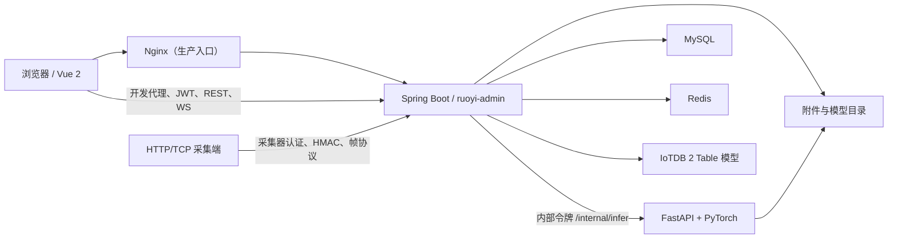
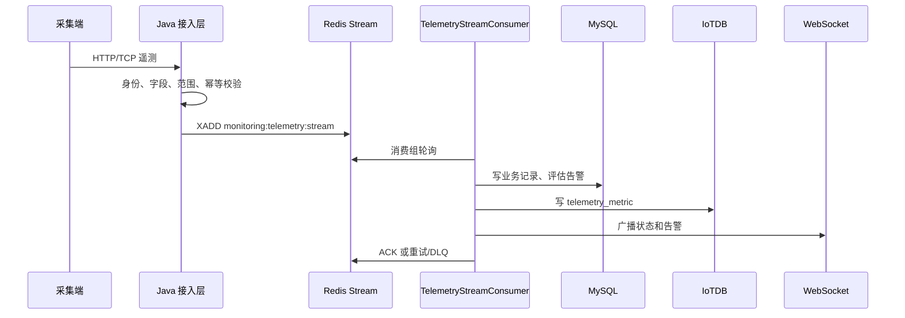
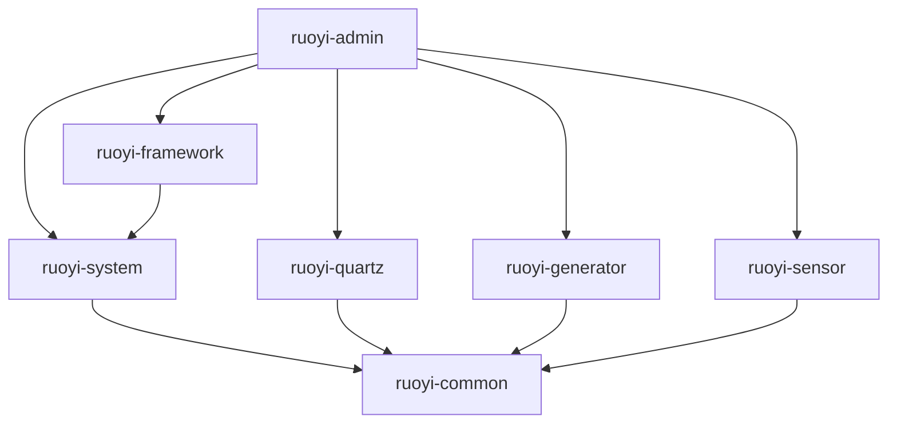

# AI 项目总览与工作指南

> [!CAUTION]
> **本文件包含本机运行密码、令牌和绝对路径。仅限当前计算机上的受信任 AI 与开发者使用。**
> 不得提交、暂存、推送、上传、截图、粘贴到工单或聊天，也不得打入构建产物。
> 文件当前受 Git 跟踪；阅读、修改或分享前必须先确认 `git status --short`。

本文是 RuoYi-Vue 工业设备健康管理项目的可验证知识地图。
它帮助 AI 快速回答四类问题：项目如何运行、代码在哪里、改动影响什么、怎样证明改动正确。
它不是产品宣传页，也不替代源码、配置、迁移、测试和部署脚本。

---
## 0. 使用方法、事实边界与证据优先级

### 0.1 阅读顺序

第一次接触项目时按以下顺序阅读：

1. §1 五分钟项目地图；
2. §2 能力成熟度矩阵；
3. §3 与任务相关的数据流；
4. §4 修改入口；
5. §10 当前陷阱和已知问题；
6. 最后阅读目标源码和测试。

开始任何任务前重新确认仓库状态：

```powershell
git status --short
git log -1 --oneline --decorate
```

本文核对时的工作区快照：

- 日期：2026-08-13；
- 分支：`main`；
- `HEAD`：`8b35449`（`docs: add AI project overview`）；
- `AI_PROJECT_OVERVIEW.md` 已被 Git 跟踪且已有用户修改；
- 根 `pom.xml`、`run-all.ps1`、`run-admin.ps1`、旧 `deploy/` 和 `phm-pages-demo.html` 当前处于删除状态；
- `AI_PROJECT_OVERVIEW.md.bak-20260813` 是未跟踪备份，不是权威文档。

快照只说明检查时的磁盘事实。
若 Git 状态已经变化，以重新执行命令的结果为准，不要机械沿用上述值。

### 0.2 证据优先级

描述冲突时按以下顺序判断：

1. 当前 Java、Vue、Python 源码；
2. 当前实际生效的 Spring/Vue/Python 配置；
3. Flyway 迁移、Mapper 和数据库约束；
4. 自动化测试与 CI 工作流；
5. `start-all.ps1`、部署和打包脚本；
6. 本文件；
7. 根 README、历史 SQL、旧计划和日志。

脚本存在不等于脚本已经端到端验证。
页面存在不等于后端接口和数据表已经实现。
测试文件存在不等于它在默认 CI 中真正执行且未跳过。

### 0.3 成熟度标签

| 标签 | 判断标准 |
|---|---|
| `STABLE` | 实现存在，并有可靠自动化测试或稳定使用证据 |
| `IMPLEMENTED` | 主要实现存在，但缺少完整端到端验证 |
| `RESERVED` | 只有页面、菜单、DTO 或拟定接口契约 |
| `EXPERIMENTAL` | 算法实验、模拟器或开发辅助能力 |
| `LEGACY` | 为旧调用保留的兼容接口、配置或文件 |
| `BROKEN` | 当前工作区下已知无法按设计执行 |
| `LOCAL_ONLY` | 依赖未提交模型、数据、密码或本机路径 |
一个能力可以有多个标签，例如推理服务可同时是 `IMPLEMENTED` 和 `LOCAL_ONLY`。

### 0.4 工作区资产边界

以下内容不是普通源码，不应无故格式化、提交或删除：
| 类别 | 路径 | 处理原则 |
|---|---|---|
| 构建产物 | `**/target/`、`ruoyi-ui/dist/` | 可重建，不手改 |
| 依赖 | `ruoyi-ui/node_modules/`、`.venv/` | 不提交，不全量搜索 |
| 本地运行数据 | `.local-data/` | 可能含附件、上传、日志和 PID |
| 模型 | `.local-models/*.pth` | 由 manifest 和 SHA-256 管理 |
| 样本 | `target_unlabeled/`、`*.mat`、`*.npy` | 大体积实验输入 |
| 接收数据 | `ruoyi-sensor/inference/get/got/` | 可能用于问题复现 |
| 日志 | `*.log`、`.codex-runtime/` | 只做定点排障 |
| 本地机密 | `.env`、本文 §7.6 | 不回显、不提交、不外传 |
| IDE 数据 | `.settings/`、`.classpath`、`.project` | 非业务源码 |
---
## 1. 五分钟项目地图

### 1.1 项目定位

本项目基于 RuoYi-Vue 3.9.2 深度改造，是面向工业设备的健康管理与状态监测平台。
主要业务包括：

- 用户、角色、菜单、权限和数据范围；
- 设备、测点、振动、温度和多通道采集；
- Redis Stream 异步处理与 WebSocket 实时展示；
- PHM 健康状态、告警、事件、报表和附件；
- 齿轮、轴承模型推理及诊断任务；
- MySQL 业务记录和 IoTDB 时序投影；
- Windows 本地启动及离线部署设计。

油液监测目前只有前端预留页和菜单，不是已经落地的完整业务服务。

### 1.2 运行组件



浏览器只访问 Java/Nginx，不直接访问 Python、MySQL、Redis 或 IoTDB。
Java 是用户认证、权限、数据范围、诊断编排和持久化边界。
Python 只负责模型推理，不持有业务数据库权限。

### 1.3 代码地图

- 后端入口、公共能力和系统管理分别位于 `ruoyi-admin`、`ruoyi-common`、`ruoyi-framework`、`ruoyi-system`；Quartz 和代码生成分别位于 `ruoyi-quartz`、`ruoyi-generator`。
- 工业业务核心在 `ruoyi-sensor`；其 `mock` 是独立 Maven 模拟器，`inference` 是独立 FastAPI/PyTorch 目录。
- Vue 2 应用在 `ruoyi-ui`；离线设计、环境准备和历史 SQL 分别在 `deployment`、`setup`、`sql`。`sql` 不是生产迁移主入口。

### 1.4 当前关键阻断

1. 根 `pom.xml` 当前不存在，根 Maven reactor、默认 CI Java 构建、离线打包和 `start-all.ps1` 的 Java 构建步骤均会受阻。
2. 文档历史上引用的 `run-all.ps1`、`run-admin.ps1` 和旧 `deploy/` 已删除。
3. 油液页面调用的是拟定 `/sensor/oil-monitoring/*` 契约，Java 端没有对应 Controller 或油液遥测表。
4. 本地 `.venv` 与 `requirements.txt` 声明存在版本漂移，不能把“可导入”当作依赖一致。
5. 离线打包脚本引用错误迁移路径，签名验证脚本没有验证包内哈希和结构。

---
## 2. 能力成熟度矩阵

| 能力 | 状态 | 当前证据 | 主要限制 |
|---|---|---|---|
| 登录、JWT、动态菜单 | `STABLE` | RuoYi Security、TokenService、前端守卫 | 依赖 MySQL、Redis |
| 用户、角色、部门、字典 | `STABLE` | system 模块及原有测试 | 数据迁移仍需谨慎 |
| 振动/温度 CRUD | `STABLE` | Controller、Mapper、页面 | 兼容前缀仍存在 |
| HTTP 采集认证 | `IMPLEMENTED` | CollectorAccessService、认证过滤器 | 需要真实凭据联调 |
| Redis 遥测 Stream | `IMPLEMENTED` | 生产/消费服务及测试 | 依赖 Redis 和业务库 |
| 多通道帧 Stream | `IMPLEMENTED` | 帧管道、消费者、页面、测试 | 工业网关实机未在仓库验证 |
| 8891 签名 TCP | `IMPLEMENTED` | SensorTcpServer、HMAC、防重放测试 | 生产网络策略需部署验证 |
| 8890 历史接收器 | `LEGACY` | TcpVibrationReceiverService | 生产默认关闭 |
| 8888 MAT 接收器 | `EXPERIMENTAL` | CwruMatReceiver、启动钩子 | 仅开发/受控网络 |
| PHM 设备和测点 | `IMPLEMENTED` | PhmController、Service、迁移和测试 | 依赖数据范围正确配置 |
| 告警、事件、报表 | `IMPLEMENTED` | PHM 服务、页面、导出测试 | 完整业务闭环需环境冒烟 |
| 附件安全存储 | `IMPLEMENTED` | Storage、Scanner、测试 | 病毒扫描器为外部依赖 |
| WebSocket 票据与推送 | `IMPLEMENTED` | Redis 一次性票据、WS 测试 | Origin 和 Redis 必须可用 |
| 齿轮/轴承推理 | `IMPLEMENTED` `LOCAL_ONLY` | FastAPI、模型清单、Python 测试 | 依赖本地模型、令牌和白名单 |
| 诊断批次与多测点 | `IMPLEMENTED` | Java 服务、迁移、测试 | 需完整数据和推理服务 |
| 诊断文件摄取 | `IMPLEMENTED` | DiagnosisFileIngestionService 及测试 | 默认开关和目录需核对 |
| MySQL→IoTDB 诊断同步 | `IMPLEMENTED` | outbox、重试、健康指示器、测试 | 两个历史同名迁移易混淆 |
| IoTDB 主读/MySQL 回退 | `IMPLEMENTED` | DiagnosisResultReadService 及测试 | 需真实 IoTDB 集成验证 |
| 油液监测 | `RESERVED` | 前端页、API 封装、菜单迁移 | 无 Java Controller、服务和数据表 |
| 算法批处理脚本 | `EXPERIMENTAL` `LOCAL_ONLY` | `04*_diagnose_*.py` | 依赖未完整声明，输入数据很大 |
| 边缘网关模拟器 | `EXPERIMENTAL` | 独立 mock Maven 模块 | 不代表真实采集器 |
| 一键本地启动 | `BROKEN` `LOCAL_ONLY` | `start-all.ps1` | 根 POM 删除且依赖本机服务 |
| Windows 离线部署 | `IMPLEMENTED` `BROKEN` | deployment 脚本与说明 | 路径/校验问题，未证明端到端成功 |
---
## 3. 运行组件与关键数据流

### 3.1 登录、菜单和权限

流程：

1. Vue 通过 `src/api/login.js` 请求登录；
2. Spring Security 验证用户，`TokenService` 建立 Redis 不透明会话；
3. Redis 保存登录会话和验证码等短期状态；
4. `src/utils/request.js` 自动携带 HttpOnly 会话 Cookie 和 CSRF 请求头；
5. `src/permission.js` 拉取用户、角色和后端动态菜单；
6. Vuex 生成路由并调用 `router.addRoutes`；
7. Controller 使用 `@PreAuthorize` 校验权限；
8. PHM 服务对设备、测点、附件和历史数据再做数据范围检查。

菜单通常来自 MySQL `sys_menu`。
新增业务页面不能只改前端路由；通常还需新增 Flyway 菜单迁移、权限码和角色授权。

### 3.2 遥测采集



关键约束：

- `eventId` 是业务幂等键；
- HTTP 采集器认证由 framework 过滤器和 sensor 服务协作；
- 消费失败不能提前 ACK；
- 毒消息有限重试后进入 DLQ；
- Redis 是异步管道，不是长期业务真相；
- 新增字段要同时检查 DTO、Stream 序列化、MySQL、IoTDB 和 WS。

关键 Redis key：

- `monitoring:telemetry:stream`；
- `monitoring:telemetry:dlq`；
- `monitoring:telemetry:event:<eventId>`；
- `collector:nonce:<collectorId>:<nonce>`。

### 3.3 多通道振动帧与 TCP

通道帧使用独立 Redis Stream：

- 主流：`monitoring:vibration-frame:stream`；
- 死信：`monitoring:vibration-frame:dlq`；
- 幂等：`monitoring:vibration-frame:id:<frameId>`。

主要入口：
| 入口 | 默认端口 | 状态 | 说明 |
|---|---:|---|---|
| `SensorTcpServer` | 8891 | `IMPLEMENTED` | 签名通道帧、HMAC、nonce、防重放 |
| `TcpVibrationReceiverService` | 8890 | `LEGACY` | 历史接收器，生产默认关闭 |
| `CwruMatReceiver` | 8888 | `EXPERIMENTAL` | 开发用 MAT 文件接收 |
| `sensor.netty.port` | 9000 | `LEGACY` | 配置残留，没有代码监听 |
修改帧协议时必须同步：

- `deployment/TCP-COLLECTOR-PROTOCOL.md`；
- `CollectorTcpAuthenticator`；
- `NettyChannelFrameParser`；
- `SensorTcpChannelHandler`；
- `ChannelFramePipelineService` 和消费者；
- mock 模拟器、冒烟脚本和前端消费者。

### 3.4 Java 到 Python 推理

1. 用户或批次任务向 Java 发起诊断；
2. Java 校验 JWT、权限、设备数据范围、输入路径和模型参数；
3. Java 携带内部令牌调用统一 FastAPI `/internal/infer`；
4. Python 校验令牌、输入白名单、文件和模型 ready 状态；
5. Python 加载齿轮或轴承模型，返回诊断 JSON；
6. Java 持久化结果、关联设备/测点/通道/模型，并按策略联动告警；
7. Java 通过 WebSocket 推送状态和结果。

Python 内部接口：

- `GET /internal/health/live`；
- `GET /internal/health/ready`；
- `GET /internal/metrics`；
- `POST /internal/infer`。

这些接口需要内部令牌，默认只绑定 `127.0.0.1:5000`。
浏览器不得直接访问 Python。

模型清单位于 `ruoyi-sensor/inference/models-manifest.json`。
模型本体位于 `.local-models/`，不进入普通源码提交。
启动时必须校验 artifact、版本和 SHA-256。

### 3.5 诊断结果同步与读取

MySQL 是诊断业务记录的耐久真相，IoTDB 是时序查询投影。

写入流程：

1. 同一事务写 `enhanced_inference_record`；
2. 同一事务写 `diagnosis_iotdb_sync` outbox；
3. 提交后异步写 IoTDB `diagnosis_result`；
4. 失败转为 `RETRY` 并指数退避；
5. 租约避免多实例重复领取；
6. 状态包括 `PENDING`、`PROCESSING`、`RETRY`、`SYNCED`。

读取流程：

- 默认 `iotdb-primary`；
- 优先读取 IoTDB；
- 合并 MySQL 中尚未同步的耐久记录；
- 按记录 ID 去重；
- IoTDB 不可用时回退 MySQL；
- 服务层限制最大查询数量。

两个同名迁移不要混淆：

- `V2026072101__DiagnosisIotdbSync`：早期过渡设计；
- `V2026073001__DiagnosisIotdbSync`：现行 outbox 表。

### 3.6 WebSocket

浏览器先调用 `POST /sensor/ws-ticket` 获取 Redis 中的短时一次性票据，再握手：

- `/ws/sensor`；
- `/ws/monitoring`。

长期 JWT、内部推理令牌和采集器密钥不得进入 WebSocket URL。

修改消息结构时至少检查：

- `SensorWebSocketMessageVo`；
- `SensorWebSocketHandler`；
- 各推送服务；
- `ruoyi-ui/src/utils/sensor-websocket.js`；
- Navbar、monitoring store、PHM 告警、监测工作台、油液预留页和多通道页面。

---
## 4. 模块职责与修改入口

### 4.1 Maven 依赖方向



`ruoyi-sensor/mock` 有独立 POM，不在根 reactor 中。
`ruoyi-sensor/inference` 是 Python 目录，不属于 Maven。

### 4.2 后端高价值入口

| 修改目标 | 首选入口 | 必须连带检查 |
|---|---|---|
| PHM 聚合 | `PhmController`、`PhmService` | 数据范围、Mapper、前端、权限 |
| 工业监测 | `IndustrialMonitoringController` | IoTDB、设备范围、趋势 DTO |
| 振动/温度 | 对应 DataController | 兼容前缀、采集权限、导出 |
| 诊断编排 | `VibrationDiagnosisController` | Python 契约、任务、模型、WS |
| 诊断批次 | `VibrationBatchController` | 执行器、取消、引用完整性 |
| 模型发布 | `ModelReleaseController` | artifact、版本、SHA-256、影子运行 |
| 文件摄取 | `DiagnosisFileIngestionService` | 稳定窗口、附件安全、目录白名单 |
| 遥测 Stream | `TelemetryPipelineService` | 消费者、重试、DLQ、指标 |
| 帧 Stream | `ChannelFramePipelineService` | 解析、IoTDB、实时推送 |
| TCP 认证 | `CollectorTcpAuthenticator` | 密钥轮换、nonce、协议文档 |
| 时序存储 | `TimeSeriesStore` | IoTDB/Noop、健康、降级 |
| 诊断同步 | `DiagnosisIotdbSyncService` | outbox、租约、读合并 |
| WebSocket | ticket controller、handler | Origin、订阅权限、前端消费者 |
| 附件 | `PhmAttachmentStorageService` | 病毒扫描、路径、安全下载 |
`TimeSeriesStore` 是接口，目前只有两个实现：

- `IoTdbTimeSeriesStore`；
- `NoopTimeSeriesStore`。

### 4.3 前端高价值入口

- 框架入口：`src/main.js`、`src/permission.js`、`src/router/index.js`、`src/store`。
- 通信与接口：`src/utils/request.js`、`src/utils/sensor-websocket.js`、`src/api`。
- 共享视觉：`src/components/IndustrialMonitoring`、`src/assets/styles/industrial-theme.scss`。
- 业务页面：`src/views/phm`、`src/views/monitor/diagnosis`、`src/views/monitoring-center`、`src/views/system/vibration`。

新增页面时优先建立 `src/api` 封装，复用请求、下载、权限和主题能力。
不要在页面硬编码 `localhost`，不要直接调用 Python。

### 4.4 数据结构变更影响面

| 改动 | 同步检查 |
|---|---|
| MySQL 字段 | 新 Flyway、实体、Mapper/XML、Service、DTO/VO、前端、导出、索引 |
| IoTDB 字段 | 初始化 SQL、Java 建表、快照、编解码、查询、TTL、前端 |
| API 字段 | Controller、DTO/VO、错误语义、前端 API、页面、兼容调用 |
| WebSocket 消息 | VO、推送者、handler、JS 客户端和全部订阅者 |
| Redis key/Stream | 生产者、消费者、重试、DLQ、指标和运维告警 |
| 菜单权限 | Flyway、父菜单、组件路径、权限码、角色、Controller、按钮 |
| 模型输出 | Python、Java 归一化、数据库 JSON、页面、导出、测试 |
---
## 5. API、认证、权限与数据范围

### 5.1 API 命名空间

| API | 状态 | 认证 | 实现证据 |
|---|---|---|---|
| `/login`、`/getInfo`、`/getRouters` | `STABLE` | Cookie 会话 + CSRF | RuoYi 登录链路 |
| `/system/*` | `STABLE` | Cookie 会话 + CSRF + 权限 | system 控制器 |
| `/monitor/*` | `STABLE` | Cookie 会话 + CSRF + 权限 | 监控和 Quartz 控制器 |
| `/tool/*` | `STABLE` | Cookie 会话 + CSRF + 权限 | generator/OpenAPI |
| `/sensor/vibration-data` | `STABLE` | Cookie 会话或采集器专用令牌 | DeviceVibrationDataController |
| `/system/vibration` | `LEGACY` | 同正式接口 | 兼容映射 |
| `/sensor/temperature-data` | `STABLE` | JWT 或采集器 | DeviceTemperatureDataController |
| `/system/temperature` | `LEGACY` | 同正式接口 | 兼容映射 |
| `/sensor/monitoring` | `IMPLEMENTED` | JWT + 设备范围 | IndustrialMonitoringController |
| `/monitoring`、`/system/monitoring` | `LEGACY` | 同正式接口 | 兼容映射 |
| `/sensor/diagnosis` | `IMPLEMENTED` | JWT + 权限/范围 | VibrationDiagnosisController |
| `/sensor/diagnosis/batch` | `IMPLEMENTED` | JWT + 权限/范围 | VibrationBatchController |
| `/sensor/diagnosis/analysis` | `IMPLEMENTED` | JWT + 权限 | VibrationAnalysisController |
| `/sensor/diagnosis/models` | `IMPLEMENTED` | JWT + 管理权限 | ModelReleaseController |
| `/sensor/collectors` | `IMPLEMENTED` | JWT + 管理权限 | CollectorCredentialController |
| `/sensor/ws-ticket` | `IMPLEMENTED` | JWT | WebSocketTicketController |
| `/phm/*` | `IMPLEMENTED` | JWT + 权限/范围 | PhmController |
| `/sensor/oil-monitoring/*` | `RESERVED` | 拟定 JWT | 只有前端 API，无 Java Controller |
| `/internal/*`（Python） | `IMPLEMENTED` `LOCAL_ONLY` | 内部令牌 | inference_service.py |
新增业务调用优先使用正式 `/sensor/*` 或 `/phm/*` 前缀。
移除兼容前缀前必须搜索前端、测试、脚本和外部采集客户端。

### 5.2 返回结构

- 普通接口使用 `AjaxResult`：`code`、`msg`、`data`；
- 分页使用 `TableDataInfo`：`rows`、`total`、`code`、`msg`；
- 文件下载可以返回 Resource 或直接写响应流；
- Blob 响应不能强行包装为 JSON；
- 新增字段应保持向后兼容；
- 时间、空值、枚举和分页上限必须前后端一致。

### 5.3 四类凭据

| 凭据 | 调用方向 | 用途 | 禁止事项 |
|---|---|---|---|
| 浏览器 JWT | Vue→Java | 用户身份和权限 | 不给采集器或 Python |
| 采集器凭据/HMAC | Edge→Java | HTTP/TCP 上报 | 不放前端包，不当管理员令牌 |
| 内部推理令牌 | Java→Python | `/internal/*` | 不暴露浏览器和公网 |
| WS 一次性票据 | Browser→Java WS | 短时握手 | 不替代 JWT，不重复使用 |

### 5.4 数据范围

前端权限只控制交互，不构成安全边界。

涉及下列资源的接口必须在服务端检查设备范围：

- 设备与测点详情；
- 遥测、趋势和振动分析；
- 诊断任务、历史和导出；
- 告警、事件和报表；
- 附件元数据与文件内容；
- WebSocket 订阅。

新增接口时先找 `PhmDataScopeService` 和同领域现有查询对象。

---
## 6. 数据存储、迁移、附件与模型

### 6.1 存储职责

| 存储 | 保存内容 | 一致性角色 |
|---|---|---|
| MySQL | 权限、PHM 主数据、规则、告警、事件、附件元数据、诊断记录、同步账本 | 事务业务真相 |
| Redis | 会话、缓存、验证码、票据、去重、Stream、DLQ | 短期状态和异步管道 |
| IoTDB | telemetry_metric、vibration_frame、diagnosis_result | 高容量时序投影 |
| 附件目录 | 报告、图像、诊断输入 | 文件内容，权限元数据仍在 MySQL |
| 模型目录 | 齿轮/轴承 `.pth` | 只读模型制品 |

### 6.2 IoTDB

IoTDB 使用 Table 模型，默认数据库名为 `monitoring`。
| 表 | 默认 TTL | 用途 |
|---|---:|---|
| `telemetry_metric` | 1095 天 | 普通遥测指标 |
| `vibration_frame` | 90 天 | 波形帧和特征 |
| `diagnosis_result` | 3650 天 | 诊断历史投影 |
建表逻辑有两个维护点：

- `ruoyi-admin/src/main/resources/sql/iotdb-init.sql`；
- `IoTdbTimeSeriesStore.initializeSchema`。

修改结构时必须同步两者。
不要用 Tree CLI 执行 Table 模型脚本。

### 6.3 时序存储切换

- `sensor.store-type=iotdb`：使用 IoTDB；
- `sensor.store-type=noop`：使用 Noop；
- Noop 不是“正常空数据库”；
- 不可用时应明确降级、回退或返回 503；
- 不要把存储失败伪装成空结果。

### 6.4 MySQL 生产迁移

生产迁移主线：

```text
ruoyi-admin/src/main/java/db/migration/V<版本>__<描述>.java
```

规则：

1. 新增严格单调且未使用的版本；
2. 已在任何共享环境执行的迁移不可修改；
3. 修复必须新增更高版本；
4. 迁移需考虑历史数据、空值、重复值和索引；
5. 菜单、权限和业务索引也进入迁移；
6. 新迁移需有针对性测试；
7. 执行生产迁移前必须备份并验证恢复。

列出实际迁移，不在文档中硬编码数量：

```powershell
rg --files ruoyi-admin/src/main/java/db/migration | Sort-Object
git status --short -- ruoyi-admin/src/main/java/db/migration
```

`sql/` 下的历史脚本用于空库安装、溯源或旧环境升级，不替代当前 Flyway 主线。

### 6.5 附件和模型

附件内容位于受控根目录，元数据和数据范围在 MySQL；上传限制大小、类型和路径，下载重新鉴权，生产可要求外部病毒扫描。

模型 manifest 在源码目录，`.pth` 在本地模型目录；artifact、版本、环境变量和 SHA-256 必须一致，不允许静默替换同版本模型或将模型加入普通提交。

---
## 7. 配置、依赖、端口与本地运行信息

### 7.1 配置文件

| 文件 | 职责 |
|---|---|
| `application.yml` | 公共默认值，缺省 profile 为 prod |
| `application-dev.yml` | 本地推理、IoTDB、采集和开发 Origin |
| `application-prod.yml` | 环境注入、Flyway、管理端口和生产限制 |
| `application-druid.yml` | MySQL/Druid |
| `ruoyi-ui/.env.development` | 开发 API 前缀 |
| `ruoyi-ui/.env.production` | 生产 API 前缀 |
| `ruoyi-ui/.env.staging` | 预发布构建 |
| `.env.example` | 根环境变量模板 |
| `.env` | 本机真实配置，不提交 |
手工启动 Java 时必须明确 `dev`，否则公共配置默认进入 `prod`。

### 7.2 声明技术栈

声明版本应来自 POM、`package.json`、锁文件和 `requirements.txt`，不是来自当前缓存目录。
| 层 | 声明 |
|---|---|
| Java 编译目标 | JDK 17 |
| Spring Boot | 3.4.5 |
| Spring Security/JWT | Spring Security + JJWT 0.13.0 |
| ORM | MyBatis starter 3.0.4、MyBatis-Plus 3.5.9 |
| Druid | 1.2.28 |
| IoTDB Session | 2.0.8 |
| Netty | 4.1.118.Final |
| Vue | 2.6.12 |
| Vue Router/Vuex | 3.4.9 / 3.6.0 |
| Element UI | 2.15.14 |
| ECharts | 5.4.0 |
| Vue CLI | 4.4.6 |
| FastAPI/Uvicorn | 0.115.12 / 0.34.2 |
| NumPy/SciPy/PyTorch | 2.2.5 / 1.15.2 / 2.6.0 |
| pytest | 8.3.5 |
根 POM 当前删除，因此 Java 声明版本取自 `HEAD:pom.xml`，不是当前磁盘可执行配置。

### 7.3 Python 依赖分层

`requirements.txt` 声明推理服务所需的 FastAPI/Uvicorn、NumPy/SciPy/PyTorch、multipart、Prometheus 和 WebSocket 支持，以及正式测试使用的 pytest。

实验/辅助脚本还使用未进入服务清单的 `pandas`、`tqdm`、`requests` 和 `h5py`（部分格式分支）。

不要因为推理服务可启动，就假定所有 `04*_diagnose_*.py` 和 pipeline 脚本都可运行。

### 7.4 本地实际环境

2026-08-13 检查到：

- 系统 Python：3.11.9；
- 项目 `.venv` Python：3.14.2；
- `.venv` 中 NumPy、SciPy、PyTorch 版本与 requirements 声明不一致；
- `.venv` 还报告过无效 distribution 警告。

执行 Python 任务前重新检查：

```powershell
python --version
.\.venv\Scripts\python.exe --version
.\.venv\Scripts\python.exe -m pip check
.\.venv\Scripts\python.exe -m pip freeze
```

推荐基线是 Python 3.11 创建的项目虚拟环境。
不要把本机包版本误写成项目声明版本。

### 7.5 默认端口

| 端口 | 服务 | 暴露原则 |
|---:|---|---|
| 80 | Vue 开发服务器或生产 Nginx | 用户入口 |
| 8080 | Spring Boot API | 生产经 Nginx |
| 8081 | 生产 Actuator | 本机/管理网络 |
| 3306 | MySQL | 不公开 |
| 6379 | Redis | 不公开 |
| 5000 | FastAPI | 仅环回和内部令牌 |
| 6667 | IoTDB DataNode RPC | 内部网络 |
| 10710 | IoTDB ConfigNode | 内部网络 |
| 8888 | MAT 接收器 | 开发/受控网络 |
| 8890 | 历史 TCP | 生产默认关闭 |
| 8891 | 签名通道 TCP | 专用工业网络 |
| 9000 | 残留配置 | 当前无代码监听 |
| 9528/5001 | 历史端口 | 仅旧进程清理逻辑涉及 |

### 7.6 本地运行信息（敏感明文）

> [!WARNING]
> 以下值直接来自根 `.env`，属于本机秘密。
> 本节不得出现在 Git 提交、远程仓库、截图、聊天、日志或发布包中。
> 实际配置发生变化后，应重新生成本节，不能保留过期秘密副本。

#### MySQL、Redis 与 IoTDB

| 变量 | 当前真实值 | 使用方 | 用途 | 证据位置 |
|---|---|---|---|---|
| `MYSQL_URL` | <code>jdbc:mysql://localhost:3306/ry-yue?useUnicode=true&amp;characterEncoding=utf8&amp;zeroDateTimeBehavior=convertToNull&amp;useSSL=false&amp;allowPublicKeyRetrieval=true&amp;serverTimezone=GMT%2B8</code> | Spring prod | JDBC 地址 | `application-prod.yml` |
| `MYSQL_USERNAME` | <code>root</code> | Spring prod | 数据库用户 | `application-prod.yml` |
| `MYSQL_PASSWORD` | <code>必须由部署环境注入</code> | Druid/Spring | 数据库密码 | `application-druid.yml` |
| `REDIS_HOST` | <code>localhost</code> | Spring prod | Redis 主机 | `application-prod.yml` |
| `REDIS_PORT` | <code>6379</code> | Spring/setup | Redis 端口 | `application-prod.yml`、`setup-env.ps1` |
| `REDIS_DATABASE` | <code>0</code> | Spring prod | Redis DB | `application-prod.yml` |
| `REDIS_PASSWORD` | <code></code> | Spring prod | Redis 密码 | `application-prod.yml` |
| `IOTDB_HOME` | <code>C:\iotdb\apache-iotdb-2.0.8-all-bin</code> | start-all | IoTDB 安装根目录 | `start-all.ps1` |
| `IOTDB_NODE_URLS` | <code>localhost:6667</code> | Spring prod | IoTDB 节点列表 | `application-prod.yml` |
| `IOTDB_USERNAME` | <code>root</code> | Spring prod | IoTDB 用户 | `application-prod.yml` |
| `IOTDB_PASSWORD` | <code>root</code> | Spring | IoTDB 密码 | `application*.yml` |
| `IOTDB_DIAGNOSIS_TTL_DAYS` | <code>3650</code> | Spring | 诊断投影 TTL | `application.yml` |

#### 安全、Origin 与采集器

| 变量 | 当前真实值 | 使用方 | 用途 | 证据位置 |
|---|---|---|---|---|
| `RUOYI_SESSION` | <code>随机不透明值（只存在 Redis/HttpOnly Cookie）</code> | Spring Security | 浏览器会话标识 | `TokenService` |
| `DRUID_CONSOLE_PASSWORD` | <code>必须由部署环境注入</code> | Druid | 管理控制台密码 | `application-druid.yml` |
| `CORS_ALLOWED_ORIGINS` | <code>http://localhost:80,http://localhost:9528,http://localhost,http://127.0.0.1,http://127.0.0.1:80,http://127.0.0.1:9528</code> | Spring | HTTP CORS 白名单 | `application.yml`、`application-prod.yml` |
| `SENSOR_WS_ALLOWED_ORIGINS` | <code>http://localhost:80,http://localhost:9528,http://localhost,http://127.0.0.1,http://127.0.0.1:80,http://127.0.0.1:9528</code> | WebSocket | WS Origin 白名单 | `application*.yml` |
| `REFERER_ALLOWED_DOMAINS` | <code>phm.example.internal</code> | Spring prod | 防盗链/Referer 白名单 | `application-prod.yml` |
| `XSS_ENABLED` | <code>false</code> | Spring | XSS 过滤开关 | `application.yml` |
| `SENSOR_COLLECTOR_MASTER_KEY` | <code>dev-collector-master-key-for-local-dev-use</code> | 采集认证 | 采集器密钥加密主密钥 | `application-dev.yml`、`application-prod.yml` |

#### 推理和模型

| 变量 | 当前真实值 | 使用方 | 用途 | 证据位置 |
|---|---|---|---|---|
| `SENSOR_GEAR_INFER_URL` | <code>http://127.0.0.1:5000/internal/infer</code> | Java | 齿轮推理地址 | `start-all.ps1`、`application.yml` |
| `SENSOR_BEARING_INFER_URL` | <code>http://127.0.0.1:5000/internal/infer</code> | Java | 轴承推理地址 | `start-all.ps1`、`application.yml` |
| `SENSOR_INFER_URL` | <code>http://127.0.0.1:5000/internal/infer</code> | Java prod | 统一推理地址 | `application-prod.yml` |
| `SENSOR_INFERENCE_INTERNAL_TOKEN` | <code>dev-inference-token-not-for-production</code> | Java/Python | 内部接口令牌 | `start-all.ps1`、`application*.yml` |
| `GEAR_MODEL_VERSION` | <code>1.0.0</code> | Python/start-all | 齿轮模型版本 | `inference_service.py` |
| `BEARING_MODEL_VERSION` | <code>1.0.0</code> | Python/start-all | 轴承模型版本 | `inference_service.py` |
| `SENSOR_DIAGNOSIS_AUTO_ALARM_ENABLED` | <code>false</code> | Java | 诊断自动告警开关 | `application.yml` |

#### 文件、日志与扫描

| 变量 | 当前真实值 | 使用方 | 用途 | 证据位置 |
|---|---|---|---|---|
| `SENSOR_ATTACHMENT_ROOT` | <code>C:/ruoyi-secure/attachments</code> | Java/Python | 附件与允许输入根目录 | `start-all.ps1`、`application*.yml` |
| `SENSOR_ATTACHMENT_SCAN_COMMAND` | <code>C:/Program Files/Windows Defender/MpCmdRun.exe</code> | Java | 病毒扫描命令 | `application*.yml` |
| `SENSOR_ATTACHMENT_SCAN_ARGUMENTS` | <code>-Scan,-ScanType,3,-File,{file},-DisableRemediation</code> | Java | 病毒扫描参数 | `application*.yml` |
| `RUOYI_PROFILE` | <code>C:/ruoyi/data</code> | Java/start-all | 上传与运行数据根目录 | `start-all.ps1`、`application*.yml` |
| `LOG_PATH` | <code>C:/ruoyi/logs</code> | Java | 日志目录 | `application-prod.yml`、`logback.xml` |
根 `.env` 中的 `SENSOR_DIAGNOSIS_IOTDB_WRITE_ENABLED` 未找到当前代码、配置或脚本引用，因此没有复制到本节。
不得仅因为变量存在于 `.env` 就推断功能会生效。

---
## 8. 开发启动、CI 与生产部署

### 8.1 当前开发入口

当前仅保留根 `start-all.ps1`。

它设计为：

1. 导入 `.env`；
2. 检查 Maven、Java、npm、`.venv`、IoTDB 和模型；
3. 检查 MySQL、Redis；
4. 校验模型 manifest 与 SHA-256；
5. 清理确认属于项目的旧端口；
6. 默认执行根 Maven 多模块构建；
7. 启动 IoTDB、Python、Java 和 Vue；
8. 执行就绪检查；
9. 写本地日志和 PID。

当前状态为 `BROKEN`：根 `pom.xml` 已删除，默认 Maven 构建无法按设计完成。
`-SkipBuild` 只能在已有可用 `ruoyi-admin.jar` 时绕过构建，不是长期修复。

历史 `run-all.ps1` 和 `run-admin.ps1` 已删除，不应继续推荐。

### 8.2 分组件命令

以下 Java 命令只有在根 POM 恢复或提供等价 reactor 后才成立：

```powershell
mvn -DskipTests install
mvn -pl ruoyi-admin spring-boot:run -Dspring-boot.run.profiles=dev
```

前端：

```powershell
Set-Location ruoyi-ui
npm ci
npm run dev
```

Python 服务必须注入内部令牌、模型路径/SHA 和输入白名单后运行：

```powershell
.\.venv\Scripts\python.exe ruoyi-sensor\inference\inference_service.py
```

不要直接使用全局 Python 包环境。

### 8.3 CI

`.github/workflows/production-ci.yml` 当前声明：

1. Windows runner；
2. Temurin Java 25 运行 Maven，代码目标仍是 Java 17；
3. Node 20；
4. Python 3.11；
5. 主 Maven `clean test package`；
6. 独立构建 `ruoyi-sensor/mock`；
7. 前端 audit、build、bundle budget 和 Playwright；
8. Python 安装、compileall 和 pytest；
9. gitleaks；
10. 上传构建产物。

当前根 POM 删除会阻断 CI 的主 Maven 步骤。

Playwright 默认可靠覆盖：

- 登录页渲染；
- 匿名访问受保护路由时重定向；
- 固定工业主题；
- 移动端登录布局。

需要 `PHM_E2E_USER` 和 `PHM_E2E_PASSWORD` 的 PHM、油液路径会条件跳过。
因此 CI 显示 Playwright 通过，不代表认证业务闭环实际运行。

### 8.4 Windows 离线部署

`deployment/` 提供：

- 离线包构建；
- CMS 签名；
- WinSW 服务 XML；
- Nginx 配置；
- Prometheus/告警配置；
- 发布目录切换；
- 备份恢复说明。

当前只能视为部署设计与部分实现，不能宣称端到端交付已经验证。

已确认问题：

1. `build-offline-package.ps1` 复制不存在的 `ruoyi-admin/src/main/resources/db/migration`；真实迁移在 Java 源码路径。
2. `verify-offline-package.ps1` 只检查 CMS 签名，没有解压验证 `SHA256SUMS.json`。
3. 验证脚本没有检查离线包必需目录、文件和模型清单。
4. 打包输出布局与 WinSW 中 `%BASE%` 相对路径需要在干净机器验证。
5. `switch-release.ps1` 从脚本目录推导根目录，与 README 中的安装根布局需要统一。
6. 仓库没有记录成功安装、升级、回滚和恢复演练的机器可验证结果。

生产要求仍然成立：

- Nginx 是唯一面向用户的 HTTPS 入口；
- Java 和 Python 只绑定内部地址；
- MySQL、Redis、IoTDB 和 TCP 端口受防火墙限制；
- Java 不在生产拉起 Python 子进程；
- Actuator 使用独立管理端口；
- 真实秘密由受控环境注入，而不是来自本文件。

---
## 9. 测试与验收矩阵

### 9.1 总矩阵

| 子系统 | 命令/入口 | 前置条件 | 写数据 | 可能跳过 | 成功标准 | 当前证据 |
|---|---|---|---|---|---|---|
| Java 全量 | `mvn clean test package` | 根 POM、JDK、Maven | 构建产物 | Surefire 条件测试 | 全部测试和打包成功 | 当前被根 POM 删除阻断 |
| sensor 定向 | `mvn -pl ruoyi-sensor -am test` | 根 reactor | target | 集成测试可能条件化 | 模块测试通过 | 测试源码存在 |
| mock | 在 `ruoyi-sensor/mock` 执行 Maven | 独立 POM | target | 取决于测试 | jar 和测试成功 | CI 声明执行 |
| 前端构建 | `npm run build:prod` | Node/npm/node_modules | dist | 否 | exit 0 | CI 声明执行 |
| Bundle | `npm run check:bundle` | 已生成 dist | 否 | 否 | 入口/异步包均不超预算 | 脚本存在 |
| Playwright 基础 | `npm run test:e2e` | Chromium、前端 | trace/test-results | 业务用例可跳过 | 基础用例通过 | 测试存在 |
| PHM E2E | 同上 + 账号变量 | Java、数据库、账号 | 可能 | 无变量必跳过 | 登录并进入诊断页 | 条件测试存在 |
| Python 正式测试 | `.venv ... pytest inference/tests` | 匹配依赖 | pytest cache | 测试内可能 mock | tests 全绿 | 测试源码存在 |
| Python ready | `/internal/health/ready` | 模型、SHA、令牌 | 日志 | 否 | 2xx 且模型 ready | 需本机运行验证 |
| PHM 冒烟 | `setup/phm-smoke-test.ps1` | Java、Token、业务数据 | 可写 | 参数控制 | 核心接口符合断言 | 脚本存在 |
| 八通道冒烟 | `setup/eight-channel-smoke-test.ps1` | Java、Token、采集链路 | 可写 | 否 | 帧到展示链路成功 | 脚本存在 |
| 离线部署 | 干净 Windows VM | 全部 runtime、证书、WinSW | 系统服务/目录 | 否 | 安装、升级、回滚、恢复均通过 | 尚无完整证据 |

### 9.2 定向验证规则

Java 改动优先选择与采集认证、Stream、诊断、IoTDB、PHM 数据范围、附件、WebSocket、Controller 安全或 Flyway 直接相关的最小测试；运行 `IntegrationTest` 前确认 Redis、IoTDB 或容器条件。

前端改动执行：

```powershell
Set-Location ruoyi-ui
npm run build:prod
npm run check:bundle
npm run test:e2e:list
npm run test:e2e
```

验收记录后端是否启动、代理目标、业务账号是否存在、skipped 数量、trace 和 bundle 预算结果。

Python 改动执行：

```powershell
.\.venv\Scripts\python.exe -m pip check
.\.venv\Scripts\python.exe -m pytest ruoyi-sensor\inference\tests
```

模型或接口变更还需覆盖错误令牌、live/ready 差异、错误模型哈希、越界输入、两类模型输出兼容、Java 超时/错误映射和失败任务状态。

冒烟脚本可能写业务数据，运行前阅读参数和清理逻辑；迁移不在生产库试验。离线包必须在无网络干净 VM 上验证安装、升级、回滚和恢复，并记录 RPO、RTO、缺失 eventId 与人工步骤。

---
## 10. AI 修改规则、陷阱与当前问题

### 10.1 工作规则

| 阶段 | 必做事项 |
|---|---|
| 修改前 | 读目标实现；检查 Git；用 `rg` 找同字段、接口、权限、表及消费者；确认成熟度、认证、数据真相、设备范围和迁移版本 |
| 分层 | Controller 处理请求与权限，Service 处理业务不变量；复杂 SQL/算法不复制到 Controller；实体不直接充当长期外部契约 |
| 数据 | MySQL 变化新增迁移；Redis 不作耐久真相；异步链路保留幂等、有限重试、DLQ 和指标 |
| 前端 | API 放在 `src/api`；不硬编码地址或秘密；前端权限不能替代服务端权限；浏览器不直连 Python |
| 模型 | artifact、版本和 SHA 必须一致，不静默替换；输入始终受白名单限制 |
| 资产 | 不覆盖用户改动，不擅自恢复删除文件，不提交日志、模型、样本、依赖、构建产物或秘密 |
| 验证 | 运行最小相关测试，检查 skipped 和外部条件；执行 `git diff --check` 与 `git status --short`；同步必要文档 |

### 10.2 已确认陷阱

1. **9000 是幽灵端口**：有配置，无监听实现。
2. **CI Java 25 不等于代码目标 Java 25**：编译目标仍是 17。
3. **两个 DiagnosisIotdbSync 迁移不是同一设计**：以版本号和源码判断。
4. **模型默认路径不可依赖**：真实模型由本地目录和环境变量注入。
5. **manifest 不在模型目录**：manifest 属于源码，artifact 属于本地资产。
6. **`SENSOR_TCP_ENABLED` 命名容易误导**：生产配置需确认它绑定的是 8891 channel-tcp 还是历史 8890。
7. **历史迁移说明路径错误**：生产 Java 迁移不在 resources。
8. **前端 `api/system/vibration.js` 是兼容 shim**：新诊断调用优先正式 API。
9. **根 README 的旧 Python 端口和公开接口描述不可信**：以 `/internal/*` 实现为准。
10. **pyc 不是源码**：不要从孤儿字节码“恢复”已删除脚本。
11. **mock 不在主 reactor**：协议改动后要独立构建。
12. **默认 profile 是 prod**：手工开发启动必须显式 dev。
13. **油液监测只是预留**：页面和 API 文件不代表 Java 服务存在。
14. **E2E 可能通过但业务用例全部跳过**：必须检查 skip 统计和账号变量。
15. **本文含真实秘密**：不得提交或复制；后续 AI 回复不得回显 §7.6。

### 10.3 当前已知问题

| 问题 | 影响 | 证据 | 建议处理方向 |
|---|---|---|---|
| 根 POM 删除 | Java 构建、CI、start-all、离线包阻断 | Git 状态、脚本 Maven 调用 | 单独确认删除意图后恢复或重构 reactor |
| 辅助启动脚本删除 | 旧操作说明失效 | Git 状态 | 统一保留 start-all 或提供新入口 |
| 油液后端缺失 | 预留页无法加载真实数据 | 前端提示、无 Controller/表 | 明确产品需求后设计数据模型和 API |
| `.venv` 版本漂移 | 推理结果和兼容性不可复现 | Python/pip 实际检查 | 用 Python 3.11 按锁定依赖重建 |
| 离线迁移路径错误 | 打包在 Copy-Item 阶段失败 | build-offline-package.ps1 | 改为真实 Java 迁移路径或取消冗余复制 |
| 包验证不完整 | 被篡改的包内文件可能未被逐项发现 | verify 脚本 | 校验签名后解压并核验 manifest/结构 |
| 部署相对路径未统一 | WinSW、release switch 可能找错目录 | XML、脚本、README | 选定安装根并做干净 VM 演练 |
| README 推理说明过时 | 人工启动错误端口/接口 | README 与源码冲突 | 后续同步 README |
| `.env` 有未引用开关 | 容易误判 IoTDB 写入开关已生效 | 引用搜索为零 | 删除遗留变量或实现并记录 |
| 本文已跟踪且含秘密 | 误暂存会泄露全部本地凭据 | `git ls-files` | 保持仅本地修改，提交前强制检查 |

### 10.4 排障索引

| 现象 | 首查 |
|---|---|
| 登录/验证码失败 | Redis、MySQL、JWT、验证码配置、Java 日志 |
| 前端 502 | Java 端口、代理前缀、base URL |
| 菜单不出现 | Flyway、sys_menu、角色、组件路径、权限码 |
| 接口 403 | JWT、PreAuthorize、按钮权限、设备范围 |
| 实时数据不更新 | 采集认证、Stream、DLQ、消费者、WS 票据/Origin |
| IoTDB 查询 503 | store-type、连接、Table 模型、健康状态 |
| 诊断失败 | Python ready、令牌、模型哈希、输入白名单、超时 |
| 诊断历史缺失 | MySQL、同步账本、IoTDB、read-mode |
| 附件上传失败 | 根目录权限、大小、扫描器、设备范围 |
| 迁移报错 | 版本撞号、两个同名迁移、历史数据约束 |
| 8891 未监听 | channel-tcp 开关、绑定地址、端口占用 |
| Maven 找不到项目 | 根 pom.xml 当前删除 |
| 油液接口 404 | 后端尚未实现，页面为 RESERVED |

### 10.5 最终原则

本文件的价值在于指出证据、边界和验证方式，而不是替代代码。
任何架构、配置、迁移、运行入口或成熟度发生变化时，都应同步更新相关唯一章节。
如果无法证明某能力已经端到端工作，应明确写“未验证”，不要用文件数量或脚本名称推断生产可用。
