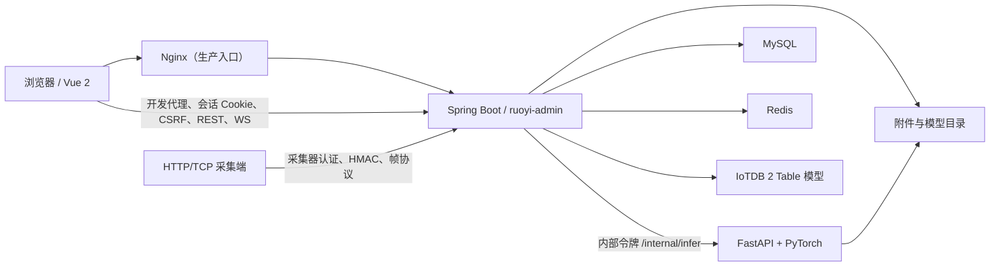
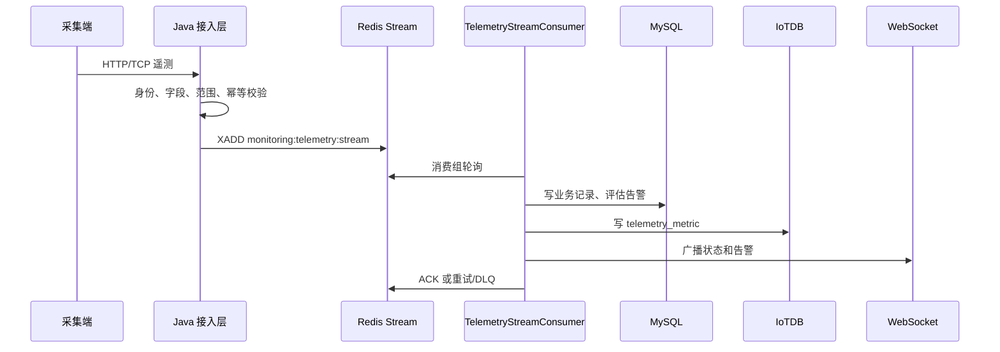
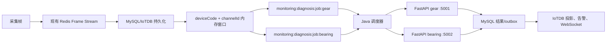
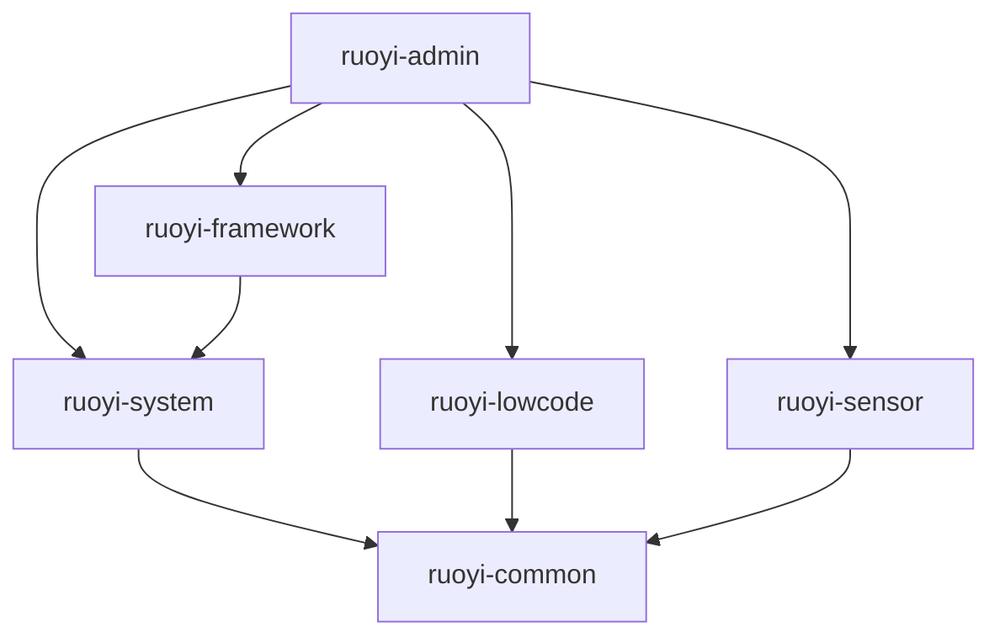

# AI 项目总览与工作指南

> [!CAUTION]
> **本文件包含本机运行密码、令牌和绝对路径。仅限当前计算机上的受信任 AI 与开发者使用。**
> 不得提交、暂存、推送、上传、截图、粘贴到工单或聊天，也不得打入构建产物。
> 文件当前受 Git 跟踪（`git ls-files` 可确认）；阅读、修改或分享前必须先确认 `git status --short`。
> 建议后续将本文移出 Git 跟踪，仅保留本地未跟踪副本（见 §10.3）。

本文是 RuoYi-Vue 工业设备健康管理（PHM）项目的可验证知识地图。
它帮助 AI 快速回答四类问题：项目如何运行、代码在哪里、改动影响什么、怎样证明改动正确。
它不是产品宣传页，也不替代源码、配置、迁移、测试和部署脚本。

---
## 0. 使用方法、事实边界与证据优先级

### 0.1 阅读顺序

第一次接触项目时按以下顺序阅读：

1. §1 五分钟项目地图；
2. §2 能力成熟度矩阵；
3. §3 与任务相关的数据流；
4. §4 修改入口；
5. §10 当前陷阱和已知问题；
6. 最后阅读目标源码和测试。

开始任何任务前重新确认仓库状态：

```powershell
git status --short
git log -1 --oneline --decorate
```

本文核对时的工作区快照（2026-08-16）：

- 分支：`main`；
- `HEAD`：`f977c47`（`Prevent first-login password gate request and icon regressions`）；
- 根 `pom.xml` 已恢复并在 Git 跟踪中，Maven 多模块构建可执行；
- `start-all.ps1` 可执行，支持 `-SkipBuild` / `-ForcePortCleanup` / `-FrontendPort`；
- 工作区存在未提交改动：低代码控制器与权限迁移 `V2026081402__LowCodePermissionBoundary.java`（未跟踪）、`ruoyi-ui/src/views/monitoring-center/history-data/`（未跟踪）、`VibrationDiagnosisController` 历史下载权限放宽、`request.js` 403 提示等；
- `setup/` 目录已删除；`run-all.ps1`、`run-admin.ps1` 已删除；
- 新增安全文档：`SECURITY_AUDIT_REPORT_2026-08-13.md`、`SECURITY_EXCEPTIONS.md`、`SECURITY_REMEDIATION_TRACKER.md`；
- 离线部署目录已移除，当前项目保留本地开发启动脚本；
- `REALTIME_DIAGNOSIS_UPGRADE_PLAN.md` 已重写为单台 Windows Server、CPU 优先的多测点多模型实时诊断实施方案；实时策略、窗口缓冲、Redis 任务流、双模型 worker 和部署配置已落地，现场 Redis/IoTDB/模型进程演练仍需执行；
- `AI_PROJECT_OVERVIEW.md.bak-20260813` 已不存在，不是权威文档。

快照只说明检查时的磁盘事实。
若 Git 状态已经变化，以重新执行命令的结果为准，不要机械沿用上述值。

### 0.2 证据优先级

描述冲突时按以下顺序判断：

1. 当前 Java、Vue、Python 源码；
2. 当前实际生效的 Spring/Vue/Python 配置；
3. Flyway 迁移、Mapper 和数据库约束；
4. 自动化测试与 CI 工作流；
5. `start-all.ps1` 本地开发启动脚本；
6. 本文件；
7. 根 README、`sql/` 历史 SQL、安全文档和旧日志。

脚本存在不等于脚本已经端到端验证。
页面存在不等于后端接口和数据表已经实现。
测试文件存在不等于它在默认 CI 中真正执行且未跳过。

### 0.3 成熟度标签

| 标签 | 判断标准 |
|---|---|
| `STABLE` | 实现存在，并有可靠自动化测试或稳定使用证据 |
| `IMPLEMENTED` | 主要实现存在，但缺少完整端到端验证 |
| `RESERVED` | 只有页面、菜单、DTO 或拟定接口契约 |
| `EXPERIMENTAL` | 算法实验、模拟器或开发辅助能力 |
| `LEGACY` | 为旧调用保留的兼容接口、配置或文件 |
| `BROKEN` | 当前工作区下已知无法按设计执行 |
| `LOCAL_ONLY` | 依赖未提交模型、数据、密码或本机路径 |
一个能力可以有多个标签，例如推理服务可同时是 `IMPLEMENTED` 和 `LOCAL_ONLY`。

### 0.4 工作区资产边界

以下内容不是普通源码，不应无故格式化、提交或删除：
| 类别 | 路径 | 处理原则 |
|---|---|---|
| 构建产物 | `**/target/`、`ruoyi-ui/dist/` | 可重建，不手改 |
| 依赖 | `ruoyi-ui/node_modules/`、`.venv/` | 不提交，不全量搜索 |
| 本地运行数据 | `.local-data/` | 可能含附件、上传、日志和 PID |
| 模型 | `.local-models/*.pth` | 由 manifest 和 SHA-256 管理 |
| 样本 | `target_unlabeled/`、`*.mat`、`*.npy` | 大体积实验输入 |
| 接收数据 | `ruoyi-sensor/inference/get/got/` | 可能用于问题复现 |
| 日志 | `*.log`、`.codex-runtime/` | 只做定点排障 |
| 本地机密 | `.env`、本文 §7.6 | 不回显、不提交、不外传 |
| IDE 数据 | `.settings/`、`.classpath`、`.project` | 非业务源码 |
---
## 1. 五分钟项目地图

### 1.1 项目定位

本项目基于 RuoYi-Vue 3.9.2 深度改造，是面向工业设备的健康管理与状态监测平台（PHM）。
主要业务包括：

- 用户、角色、菜单、权限和数据范围；
- 设备、测点、振动、温度和多通道采集；
- Redis Stream 异步处理与 WebSocket 实时展示；
- PHM 健康状态、告警、事件、报表和附件；
- 齿轮、轴承模型推理及诊断任务；
- 低代码工作台（独立数据源、版本化元数据、连接器）；
- MySQL 业务记录和 IoTDB 时序投影；
- Windows 本地一键启动设计。

油液监测目前只有前端预留页和菜单，不是已经落地的完整业务服务（见 §5.1）。

### 1.2 运行组件



浏览器只访问 Java/Nginx，不直接访问 Python、MySQL、Redis 或 IoTDB。
Java 是用户认证、权限、数据范围、诊断编排和持久化边界。
Python 只负责模型推理，不持有业务数据库权限。

### 1.3 代码地图

- 后端入口、公共能力和系统管理分别位于 `ruoyi-admin`、`ruoyi-common`、`ruoyi-framework`、`ruoyi-system`；低代码工作台位于 `ruoyi-lowcode`。
- 工业业务核心在 `ruoyi-sensor`；其 `mock` 是独立 Maven 模拟器（`vibration-simulator`），`inference` 是独立 FastAPI/PyTorch 目录。
- Vue 2 应用在 `ruoyi-ui`；历史 SQL 在 `sql`（不是生产迁移主入口）。
- 安全文档：`SECURITY_AUDIT_REPORT_2026-08-13.md`、`SECURITY_EXCEPTIONS.md`、`SECURITY_REMEDIATION_TRACKER.md`。
- 低代码 V2：后端在 `ruoyi-lowcode/core`，公共 SPI 在 `ruoyi-common/lowcode`，前端在 `ruoyi-ui/src/views/tool/lowcode`。

### 1.4 当前关键注意点

1. 根 `pom.xml` 已恢复，根 Maven reactor、CI Java 构建、`start-all.ps1` 的构建步骤均可用。
2. 认证已从 JWT 迁移为 Redis 不透明会话 Cookie（`RUOYI_SESSION`）+ CSRF 双提交；`.env` 中的 `JWT_SECRET` 已无代码引用。
3. 油液页面调用的是拟定 `/sensor/oil-monitoring/*` 契约，Java 端没有对应 Controller 或油液遥测表。
4. `.venv` 与 `requirements.txt` 声明存在版本漂移（numpy/scipy/torch 均偏高），且 `.venv` 未安装 `pytest`，不能把“可导入”当作依赖一致。
5. 离线打包脚本已改为使用编译产物中的 Flyway 迁移目录，但干净 Windows VM 端到端演练仍未在仓库留下机器可验证结果。
6. 工作区存在未提交改动（低代码权限边界、历史数据下载页、低代码运维文档），改动前先看 §0.1 快照。

---
## 2. 能力成熟度矩阵

| 能力 | 状态 | 当前证据 | 主要限制 |
|---|---|---|---|
| 登录、会话 Cookie、动态菜单 | `STABLE` | Security 配置、TokenService、CSRF 过滤器、前端守卫 | 依赖 MySQL、Redis |
| 首次登录强制改密（428 门禁） | `IMPLEMENTED` | `PasswordChangeRequiredFilter`、迁移 `V2026081302`、E2E | 端到端账号流需黑盒验收 |
| 用户、角色、部门、字典 | `STABLE` | system 模块及原有测试 | 数据迁移仍需谨慎 |
| 振动/温度 CRUD | `STABLE` | Controller、Mapper、页面 | 兼容前缀仍存在 |
| HTTP 采集认证 | `IMPLEMENTED` | CollectorAccessService、认证过滤器 | 需要真实凭据联调 |
| Redis 遥测 Stream | `IMPLEMENTED` | 生产/消费服务及测试 | 依赖 Redis 和业务库 |
| 多通道帧 Stream | `IMPLEMENTED` | 帧管道、消费者、页面、测试 | 工业网关实机未在仓库验证 |
| 8891 签名 TCP | `IMPLEMENTED` | SensorTcpServer、HMAC、防重放测试 | 生产网络策略需部署验证 |
| 8890 历史接收器 | `LEGACY` | TcpVibrationReceiverService | 生产默认关闭 |
| 8888 MAT 接收器 | `EXPERIMENTAL` | CwruMatReceiver、启动钩子 | 仅开发/受控网络 |
| PHM 设备和测点 | `IMPLEMENTED` | PhmController、Service、迁移和测试 | 依赖数据范围正确配置 |
| 告警、事件、报表 | `IMPLEMENTED` | PHM 服务、页面、导出测试 | 完整业务闭环需环境冒烟 |
| 附件安全存储 | `IMPLEMENTED` | `/attachments` CRUD、随机键、所有权鉴权、病毒扫描、测试 | 病毒扫描器为外部依赖 |
| WebSocket 票据与推送 | `IMPLEMENTED` | Redis 一次性票据、WS 测试 | Origin 和 Redis 必须可用 |
| 齿轮/轴承推理 | `IMPLEMENTED` `LOCAL_ONLY` | FastAPI、模型清单、Python 测试 | 依赖本地模型、令牌和白名单 |
| 诊断批次与多测点 | `IMPLEMENTED` | Java 服务、迁移、测试 | 需完整数据和推理服务 |
| 多测点多模型实时诊断 | `IMPLEMENTED` `LOCAL_ONLY` | `RealtimeWindowBuffer`、Redis 任务流、双 worker、策略 API/UI、Flyway `V2026081503/V2026081504` | 默认关闭；现场负载、停机恢复和模型灰度尚未完成 |
| 诊断文件摄取 | `IMPLEMENTED` | DiagnosisFileIngestionService 及测试 | 默认开关和目录需核对 |
| MySQL→IoTDB 诊断同步 | `IMPLEMENTED` | outbox、重试、健康指示器、测试 | 两个历史同名迁移易混淆 |
| IoTDB 主读/MySQL 回退 | `IMPLEMENTED` | DiagnosisResultReadService 及测试 | 需真实 IoTDB 集成验证 |
| 历史数据查询下载 | `IMPLEMENTED` | 迁移 `V2026072301`、前端页面、`sensor:history:list/export` | 页面当前未跟踪，接口权限已放宽 |
| 低代码工作台 V2 | `IMPLEMENTED` | 独立数据源、版本化元数据、连接器、资源白名单、迁移和测试 | 生产写默认关闭，需独立 schema 与出站代理 |
| 油液监测 | `RESERVED` | 前端页、API 封装、菜单迁移 | 无 Java Controller、服务和数据表 |
| 算法批处理脚本 | `EXPERIMENTAL` `LOCAL_ONLY` | `04*_diagnose_*.py` | 依赖未完整声明，输入数据很大 |
| 边缘网关模拟器 | `EXPERIMENTAL` | 独立 mock Maven 模块 | 不代表真实采集器 |
| 一键本地启动 | `IMPLEMENTED` | `start-all.ps1` 可执行并通过就绪检查 | 依赖本机服务、模型和 .venv |

---
## 3. 运行组件与关键数据流

### 3.1 登录、会话、CSRF 和权限

认证已从 JWT 迁移为 **Redis 不透明会话 Cookie**，流程：

1. Vue 通过 `src/api/login.js` 先调用 `GET /csrf` 获取双提交令牌（放入 Axios 默认请求头）；
2. `POST /login` 使用 Redis 验证码 + 用户名/密码 + CSRF 头；验证通过后 `TokenService` 在 Redis 建立不透明会话；
3. `RUOYI_SESSION` 以 `HttpOnly; Secure(按配置); SameSite` Cookie 下发（`security.session.cookie-name`，开发环境 `SESSION_COOKIE_SECURE=false`）；
4. 每次请求 `JwtAuthenticationTokenFilter` 从 Cookie 解析会话；Spring Security CSRF 校验 `X-XSRF-TOKEN`；
5. `PasswordChangeRequiredFilter` 拦截 `must_change_password` 用户，要求先改密（428 / 前端弹窗跳转 `user/profile?activeTab=resetPwd`）；
6. `src/permission.js` 拉取用户、角色和后端动态菜单，Vuex 生成路由；
7. Controller 使用 `@PreAuthorize` 校验权限；
8. PHM 服务对设备、测点、附件和历史数据再做数据范围检查。

菜单来自 MySQL `sys_menu`。
新增业务页面不能只改前端路由；通常还需新增 Flyway 菜单迁移、权限码和角色授权。

### 3.2 遥测采集



关键约束：

- `eventId` 是业务幂等键；
- HTTP 采集器认证由 framework 过滤器和 sensor 服务协作；
- 消费失败不能提前 ACK；
- 毒消息有限重试后进入 DLQ；
- Redis 是异步管道，不是长期业务真相；
- 新增字段要同时检查 DTO、Stream 序列化、MySQL、IoTDB 和 WS。

关键 Redis key：

- `monitoring:telemetry:stream`；
- `monitoring:telemetry:dlq`；
- `monitoring:telemetry:event:<eventId>`；
- `collector:nonce:<collectorId>:<nonce>`。

### 3.3 多通道振动帧与 TCP

通道帧使用独立 Redis Stream：

- 主流：`monitoring:vibration-frame:stream`（默认 max-length 100000）；
- 死信：`monitoring:vibration-frame:dlq`；
- 幂等：`monitoring:vibration-frame:id:<frameId>`。

主要入口：
| 入口 | 默认端口 | 状态 | 说明 |
|---|---:|---|---|
| `SensorTcpServer` | 8891 | `IMPLEMENTED` | 签名通道帧、HMAC、nonce、防重放（dev 默认开，prod 默认关） |
| `TcpVibrationReceiverService` | 8890 | `LEGACY` | 历史接收器，生产默认关闭 |
| `CwruMatReceiver` | 8888 | `EXPERIMENTAL` | 开发用 MAT 文件接收（dev 自动 javac + 启动） |
| `sensor.netty.port` | 9000 | `LEGACY` | 配置残留，没有代码监听 |
修改帧协议时必须同步：

- `CollectorTcpAuthenticator`；
- `NettyChannelFrameParser`；
- `SensorTcpChannelHandler`；
- `ChannelFramePipelineService` 和消费者；
- mock 模拟器、冒烟脚本和前端消费者。

### 3.4 Java 到 Python 推理

1. 用户或批次任务向 Java 发起诊断；
2. Java 校验会话、权限、设备数据范围、输入路径和模型参数；
3. 开发环境调用统一 FastAPI `5000`；生产环境按模型调用 `phm-infer-gear:5001` 或 `phm-infer-bearing:5002`，携带内部令牌访问 `/internal/infer` 或 `/internal/infer/batch`；
4. Python 校验令牌、输入白名单、文件和模型 ready 状态；
5. Python 加载齿轮或轴承模型，返回诊断 JSON；
6. Java 持久化结果、关联设备/测点/通道/模型，并按策略联动告警；
7. Java 通过 WebSocket 推送状态和结果。

Python 内部接口（全部要求 `X-Internal-Token`）：

- `GET /internal/health/live`；
- `GET /internal/health/ready`；
- `GET /internal/metrics`；
- `POST /internal/infer`（兼容单项调用）；
- `POST /internal/infer/batch`（默认最多 8 项，批内单项失败隔离）。

这些接口需要内部令牌。开发统一进程默认绑定 `127.0.0.1:5000`，生产两个模型进程分别绑定 `127.0.0.1:5001/5002`。
浏览器不得直接访问 Python。

模型清单位于 `ruoyi-sensor/inference/models-manifest.json`。
模型本体位于 `.local-models/`，不进入普通源码提交。
启动时必须校验 artifact、版本和 SHA-256（`start-all.ps1` 会做）。

#### 3.4.1 多测点多模型实时链路

生产实时链路与采集持久化链路隔离：



窗口按 `(deviceCode, channelId, policy)` 隔离；同一测点可挂齿轮和轴承两个模型。任务创建时解析并固定实际模型版本，使用幂等键、截止时间、Redis AOF、ACK、`XPENDING/XCLAIM` 接管和最多两次尝试。超过 10 秒新鲜度期限记为 `EXPIRED`，不补发陈旧告警。窗口、队列或推理异常只影响诊断链路，不抛回帧消费线程，也不进入采集 DLQ。

实时策略接口：

- `/sensor/diagnosis/realtime/policies`：策略分页、创建、更新、删除；唯一键为 `(point_id, model_type)`；
- `/sensor/diagnosis/realtime/status`：策略、内存窗口、队列深度和 Pending 状态；
- `/sensor/diagnosis/inference/history?sourceType=REALTIME`：实时结果历史筛选。

生产默认 `sensor.diagnosis.realtime.enabled=false`，通过灰度和影子验证后再启用。模型目录只读、版本不可变并校验 SHA-256；Java 不因推理进程不可用而阻止启动。

### 3.5 诊断结果同步与读取

MySQL 是诊断业务记录的耐久真相，IoTDB 是时序查询投影。

写入流程：

1. 同一事务写 `enhanced_inference_record`；
2. 同一事务写 `diagnosis_iotdb_sync` outbox；
3. 提交后异步写 IoTDB `diagnosis_result`；
4. 失败转为 `RETRY` 并指数退避；
5. 租约避免多实例重复领取；
6. 状态包括 `PENDING`、`PROCESSING`、`RETRY`、`SYNCED`。

读取流程：

- 默认 `iotdb-primary`（`SENSOR_DIAGNOSIS_READ_MODE`）；
- 优先读取 IoTDB；
- 合并 MySQL 中尚未同步的耐久记录；
- 按记录 ID 去重；
- IoTDB 不可用时回退 MySQL；
- 服务层限制最大查询数量。

两个同名迁移不要混淆：

- `V2026072101__DiagnosisIotdbSync`：早期过渡设计；
- `V2026073001__DiagnosisIotdbSync`：现行 outbox 表。

### 3.6 WebSocket

浏览器先调用 `POST /sensor/ws-ticket` 获取 Redis 中的短时一次性票据，再握手：

- `/ws/sensor`；
- `/ws/monitoring`。

实现是 Spring WebSocket（`WebSocketConfig` 注册 handler + 握手拦截器，非 `@ServerEndpoint`）。
长期会话 Cookie、内部推理令牌和采集器密钥不得进入 WebSocket URL。

修改消息结构时至少检查：

- `SensorWebSocketMessageVo`；
- `SensorWebSocketHandler`；
- 各推送服务；
- `ruoyi-ui/src/utils/sensor-websocket.js`；
- Navbar、monitoring store、PHM 告警、监测工作台、油液预留页和多通道页面。

### 3.7 低代码运行时

1. 设计器（`/tool/lowcode/projects`）在独立数据源中创建/校验/发布版本化元数据；
2. 发布时写入 `lc_*` 表（独立 schema），生产默认 `lowcode.runtime.write-enabled=false`；
3. 运行时（`/lowcode/runtime/{appCode}/...`）只操作白名单表 `lc_resource_allowlist`；
4. 连接器出站请求强制经 `LOWCODE_OUTBOUND_PROXY_HOST`，且经过地址/路径校验；
5. 平台侧动作（如 `iotdb.telemetry.trend`、诊断动作）以 `LowCodeActionHandler` 注册，在 Java 内执行；
6. 所有 DML 强制主键 + 项目/租户 + 数据范围谓词，影响行数必须为 1；
7. 变更操作要求幂等键（`Idempotency-Key`），重复请求返回历史结果或 409。

---
## 4. 模块职责与修改入口

### 4.1 Maven 依赖方向



`ruoyi-sensor/mock` 有独立 POM（`vibration-simulator`），不在根 reactor 中。
`ruoyi-sensor/inference` 是 Python 目录，不属于 Maven。
根 reactor 模块：common、system、framework、lowcode、sensor、admin。

### 4.2 后端高价值入口

| 修改目标 | 首选入口 | 必须连带检查 |
|---|---|---|
| PHM 聚合 | `PhmController`、`PhmService` | 数据范围、Mapper、前端、权限 |
| 工业监测 | `IndustrialMonitoringController` | IoTDB、设备范围、趋势 DTO |
| 振动/温度 | 对应 DataController | 兼容前缀、采集权限、导出 |
| 诊断编排 | `VibrationDiagnosisController` | Python 契约、任务、模型、WS |
| 诊断批次 | `VibrationBatchController` | 执行器、取消、引用完整性 |
| 模型发布 | `ModelReleaseController` | artifact、版本、SHA-256、影子运行 |
| 文件摄取 | `DiagnosisFileIngestionService` | 稳定窗口、附件安全、目录白名单 |
| 遥测 Stream | `TelemetryPipelineService` | 消费者、重试、DLQ、指标 |
| 帧 Stream | `ChannelFramePipelineService` | 解析、IoTDB、实时推送 |
| TCP 认证 | `CollectorTcpAuthenticator` | 密钥轮换、nonce、协议文档 |
| 时序存储 | `TimeSeriesStore` | IoTDB/Noop、健康、降级 |
| 诊断同步 | `DiagnosisIotdbSyncService` | outbox、租约、读合并 |
| WebSocket | ticket controller、`WebSocketConfig` | Origin、订阅权限、前端消费者 |
| 附件 | `/attachments`（`AttachmentController`）、`PhmAttachmentStorageService` | 病毒扫描、路径、所有权鉴权 |
| 会话/CSRF | `TokenService`、`CsrfCookieFilter`、SecurityConfig | Cookie 属性、CSRF 豁免、改密门禁 |
| 低代码 | `LowCodeProjectService`、`LowCodeRuntimeService`、`LowCodeTablePolicy` | 独立数据源、白名单、出站代理 |
`TimeSeriesStore` 是接口，目前有两个实现：

- `IoTdbTimeSeriesStore`；
- `NoopTimeSeriesStore`。

### 4.3 前端高价值入口

- 框架入口：`src/main.js`、`src/permission.js`、`src/router/index.js`、`src/store`。
- 通信与接口：`src/utils/request.js`（含 CSRF、403/428 处理）、`src/utils/sensor-websocket.js`、`src/api`。
- 共享视觉：`src/components/IndustrialMonitoring`、`src/assets/styles/industrial-theme.scss`。
- 业务页面：`src/views/monitoring-center`（工作台/油液/历史数据）、`src/views/monitor/diagnosis`（测点总览+振动诊断）、`src/views/phm`、`src/views/monitoring-data`（智能诊断平台）、`src/views/system/vibration`、`src/views/tool/lowcode`。

新增页面时优先建立 `src/api` 封装，复用请求、下载、权限和主题能力。
不要在页面硬编码 `localhost`，不要直接调用 Python。

### 4.4 数据结构变更影响面

| 改动 | 同步检查 |
|---|---|
| MySQL 字段 | 新 Flyway、实体、Mapper/XML、Service、DTO/VO、前端、导出、索引 |
| IoTDB 字段 | 初始化 SQL、Java 建表、快照、编解码、查询、TTL、前端 |
| API 字段 | Controller、DTO/VO、错误语义、前端 API、页面、兼容调用 |
| WebSocket 消息 | VO、推送者、handler、JS 客户端和全部订阅者 |
| Redis key/Stream | 生产者、消费者、重试、DLQ、指标和运维告警 |
| 菜单权限 | Flyway、父菜单、组件路径、权限码、角色、Controller、按钮 |
| 模型输出 | Python、Java 归一化、数据库 JSON、页面、导出、测试 |
| 低代码元数据 | 独立数据源迁移、白名单、校验器、运行时、设计器前端 |
---
## 5. API、认证、权限与数据范围

### 5.1 API 命名空间

| API | 状态 | 认证 | 实现证据 |
|---|---|---|---|
| `/csrf` | `STABLE` | 匿名 | SysLoginController、SecurityConfig |
| `/login`、`/getInfo`、`/getRouters` | `STABLE` | 会话 Cookie + CSRF | RuoYi 登录链路 |
| `/system/*` | `STABLE` | 会话 Cookie + CSRF + 权限 | system 控制器 |
| `/monitor/*` | `STABLE` | 会话 Cookie + CSRF + 权限 | 监控控制器 |
| `/tool/*` | `STABLE` | 会话 Cookie + CSRF + 权限 | lowcode 控制器 |
| `/attachments` | `IMPLEMENTED` | 会话 + 所有权/管理员 | AttachmentController、附件测试 |
| `/sensor/vibration-data` | `STABLE` | 会话或采集器专用令牌 | DeviceVibrationDataController |
| `/system/vibration` | `LEGACY` | 同正式接口 | 兼容映射（带 Deprecation/Sunset 头） |
| `/sensor/temperature-data` | `STABLE` | 会话或采集器 | DeviceTemperatureDataController |
| `/system/temperature` | `LEGACY` | 同正式接口 | 兼容映射 |
| `/sensor/monitoring`、`/monitoring`、`/system/monitoring` | `IMPLEMENTED` | 会话 + 设备范围 | IndustrialMonitoringController、MonitoringController（后两者为兼容前缀） |
| `/sensor/diagnosis`、`/sensor/vibration` | `IMPLEMENTED` | 会话 + 权限/范围 | VibrationDiagnosisController |
| `/sensor/diagnosis/batch` | `IMPLEMENTED` | 会话 + 权限/范围 | VibrationBatchController |
| `/sensor/diagnosis/realtime/policies`、`/sensor/diagnosis/realtime/status` | `IMPLEMENTED` | 会话 + `sensor:diagnosis:realtime:*` + 设备范围 | RealtimeDiagnosisController |
| `/sensor/diagnosis/inference/history?sourceType=REALTIME` | `IMPLEMENTED` | 会话 + 权限/范围 | VibrationDiagnosisController |
| `/sensor/diagnosis/analysis` | `IMPLEMENTED` | 会话 + 权限 | VibrationAnalysisController |
| `/sensor/diagnosis/models` | `IMPLEMENTED` | 会话 + 管理权限 | ModelReleaseController |
| `/sensor/collectors` | `IMPLEMENTED` | 会话 + 管理权限 | CollectorCredentialController |
| `/sensor/ws-ticket` | `IMPLEMENTED` | 会话 | WebSocketTicketController |
| `/phm/*` | `IMPLEMENTED` | 会话 + 权限/范围 | PhmController |
| `/tool/lowcode/projects`、`/lowcode/runtime/*` | `IMPLEMENTED` | 会话 + 权限 + 白名单 | LowCode 控制器 |
| `/sensor/oil-monitoring/*` | `RESERVED` | 拟定会话 | 只有前端 API，无 Java Controller |
| `/internal/*`（Python） | `IMPLEMENTED` `LOCAL_ONLY` | 内部令牌 | inference_service.py |
| `/internal/actuator/*`（prod） | `IMPLEMENTED` | 本机管理端口 | application-prod.yml |
新增业务调用优先使用正式 `/sensor/*` 或 `/phm/*` 前缀。
移除兼容前缀前必须搜索前端、测试、脚本和外部采集客户端。

### 5.2 返回结构

- 普通接口使用 `AjaxResult`：`code`、`msg`、`data`；
- 分页使用 `TableDataInfo`：`rows`、`total`、`code`、`msg`；
- 文件下载可以返回 Resource 或直接写响应流；
- Blob 响应不能强行包装为 JSON；
- 新增字段应保持向后兼容；
- 时间、空值、枚举和分页上限必须前后端一致；
- 首次改密场景返回 428 语义（`passwordChangeRequired`）。

### 5.3 四类凭据

| 凭据 | 调用方向 | 用途 | 禁止事项 |
|---|---|---|---|
| 浏览器会话 Cookie（`RUOYI_SESSION`） | Vue→Java | 用户身份和权限 | 不给采集器或 Python，不放 JS 可读区 |
| CSRF 双提交令牌（`XSRF-TOKEN`） | Vue→Java | 防跨站请求伪造 | 不豁免非匿名安全接口 |
| 采集器凭据/HMAC | Edge→Java | HTTP/TCP 上报 | 不放前端包，不当管理员令牌 |
| 内部推理令牌 | Java→Python | `/internal/*` | 不暴露浏览器和公网 |
| WS 一次性票据 | Browser→Java WS | 短时握手 | 不替代会话 Cookie，不重复使用 |

### 5.4 数据范围

前端权限只控制交互，不构成安全边界。

涉及下列资源的接口必须在服务端检查设备范围：

- 设备与测点详情；
- 遥测、趋势和振动分析；
- 诊断任务、历史和导出；
- 告警、事件和报表；
- 附件元数据与文件内容；
- WebSocket 订阅。

新增接口时先找 `PhmDataScopeService` 和同领域现有查询对象。

---
## 6. 数据存储、迁移、附件与模型

### 6.1 存储职责

| 存储 | 保存内容 | 一致性角色 |
|---|---|---|
| MySQL（主库） | 权限、PHM 主数据、规则、告警、事件、附件元数据、诊断记录、同步账本 | 事务业务真相 |
| MySQL（低代码独立库） | `lc_project`、`lc_version`、`lc_connector`、`lc_resource_allowlist`、运行日志 | 与主库隔离的最小权限账号 |
| Redis | 会话、缓存、验证码、票据、去重、Stream、DLQ、限流计数 | 短期状态和异步管道 |
| IoTDB | telemetry_metric、vibration_frame、diagnosis_result | 高容量时序投影 |
| 附件目录 | 报告、图像、诊断输入 | 文件内容，权限元数据仍在 MySQL |
| 模型目录 | 齿轮/轴承 `.pth` | 只读模型制品 |

实时诊断任务只在 Redis Stream 中承担带时限的流式调度；MySQL 的 `sensor_inference_task` 和 `enhanced_inference_record` 是诊断业务耐久记录，IoTDB 仍是时序投影，不把 Redis 当作长期历史。

### 6.2 IoTDB

IoTDB 使用 Table 模型，默认数据库名为 `monitoring`。
| 表 | 默认 TTL | 用途 |
|---|---:|---|
| `telemetry_metric` | 1095 天 | 普通遥测指标 |
| `vibration_frame` | 90 天 | 波形帧和特征 |
| `diagnosis_result` | 3650 天 | 诊断历史投影 |
建表逻辑有两个维护点：

- `ruoyi-admin/src/main/resources/sql/iotdb-init.sql`；
- `IoTdbTimeSeriesStore.initializeSchema`。

修改结构时必须同步两者。
不要用 Tree CLI 执行 Table 模型脚本。

### 6.3 时序存储切换

- `sensor.store-type=iotdb`：使用 IoTDB；
- `sensor.store-type=noop`：使用 Noop；
- Noop 不是“正常空数据库”；
- 不可用时应明确降级、回退或返回 503；
- 不要把存储失败伪装成空结果。

### 6.4 MySQL 生产迁移

生产迁移主线：

```text
ruoyi-admin/src/main/java/db/migration/V<版本>__<描述>.java
```

规则：

1. 新增严格单调且未使用的版本；
2. 已在任何共享环境执行的迁移不可修改；
3. 修复必须新增更高版本；
4. 迁移需考虑历史数据、空值、重复值和索引；
5. 菜单、权限和业务索引也进入迁移；
6. 新迁移需有针对性测试；
7. 执行生产迁移前必须备份并验证恢复。

当前迁移版本（截至 2026-08-16）：

- `V2026081503__RealtimeDiagnosisRuntime`：实时策略表，以及任务/结果的 `source_type`、`window_id`、`deadline_at`、`queued_at`、`attempt_count` 字段与索引；
- `V2026081504__RealtimeDiagnosisMenu`：实时诊断策略菜单和权限码（父菜单不存在时安全跳过）。

```text
V2026062301__ProductionHardening
V2026062302__InferenceRecordReferences
V2026062303__ModelShadowRun
V2026062501__FixAlarmRulePrecision
V2026062502__UnifyInferenceRecordJsonTypes
V2026062503__AddAlarmDevicePointIndex
V2026062504__IndustrialChannelDiagnosisBinding
V2026070101__PhmUnifiedHealthPlatform
V2026070102__PhmCleanupInteropAndSimulationArtifacts
V2026070201__InferenceRuntimeChannelAndExportCenter
V2026070202__PhmDisplayConfigAndRecordCorrection
V2026071601__AddPhmBrainDynamicMenu
V2026072101__DiagnosisIotdbSync
V2026072201__PhmDeviceVisibility
V2026072301__HistoryDataDownload
V2026072302__InferenceTaskAndChannelReferences
V2026072303__MachineBrainHomepage
V2026072401__OilMonitoringMenu
V2026073001__DiagnosisIotdbSync
V2026081301__LowCodeV2Platform
V2026081302__BrowserSessionAndPasswordGate
V2026081303__LowCodeResourceBoundary
V2026081401__NormalizeMenuIcons
V2026081402__LowCodePermissionBoundary   （未跟踪，工作区新增）
```

列出实际迁移，不在文档中硬编码数量：

```powershell
Get-ChildItem ruoyi-admin/src/main/java/db/migration -File | Sort-Object Name | Select-Object Name
git status --short -- ruoyi-admin/src/main/java/db/migration
```

`sql/` 下的历史脚本用于空库安装、溯源或旧环境升级，不替代当前 Flyway 主线（详见 `sql/README-MIGRATIONS.md`）。

### 6.5 附件和模型

附件内容位于受控根目录（`SENSOR_ATTACHMENT_ROOT`），元数据和数据范围在 MySQL；上传限制大小、类型和路径，下载重新鉴权；附件对象使用随机存储键并校验所有者，生产可要求外部病毒扫描（`MpCmdRun.exe`）。

模型 manifest 在源码目录，`.pth` 在本地模型目录；artifact、版本、环境变量和 SHA-256 必须一致，不允许静默替换同版本模型或将模型加入普通提交。

---
## 7. 配置、依赖、端口与本地运行信息

### 7.1 配置文件

| 文件 | 职责 |
|---|---|
| `application.yml` | 公共默认值，缺省 profile 为 prod |
| `application-dev.yml` | 本地推理、IoTDB、采集和开发 Origin；低代码写默认开 |
| `application-prod.yml` | 环境注入、Flyway、管理端口、生产限制、低代码连接器代理 |
| `application.yml` | MySQL/Hikari 与公共默认值 |
| `ruoyi-ui/.env.development` | 开发 API 前缀（`/dev-api`） |
| `ruoyi-ui/.env.production` | 生产 API 前缀（`/prod-api`） |
| `ruoyi-ui/.env.staging` | 预发布构建（`/stage-api`） |
| `.env.example` | 根环境变量模板（含低代码、采集器、推理等） |
| `.env` | 本机真实配置，不提交 |
手工启动 Java 时必须明确 `dev`，否则公共配置默认进入 `prod`。

### 7.2 声明技术栈

声明版本应来自 POM、`package.json`、锁文件和 `requirements.txt`，不是来自当前缓存目录。
| 层 | 声明 |
|---|---|
| Java 编译目标 | JDK 17 |
| Spring Boot | 3.4.5 |
| Spring Security/CSRF | Spring Security + CookieCsrfTokenRepository + Redis 会话 |
| ORM | MyBatis starter 3.0.4、MyBatis-Plus 3.5.9 |
| HikariCP | Spring Boot 默认连接池 |
| IoTDB Session | 2.0.8 |
| Netty | 4.1.118.Final |
| JTransforms | 3.1 |
| Vue | 2.7.16 |
| Vue Router/Vuex | 3.6.5 / 3.6.0 |
| Element UI | 2.15.14 |
| ECharts | 6.1.0 |
| Vue CLI | 5.0.9 |
| Axios/Core-js | 1.18.1 / 3.45.1 |
| FastAPI/Uvicorn | 0.115.12 / 0.34.2 |
| NumPy/SciPy/PyTorch | 2.2.5 / 1.15.2 / 2.6.0 |
| pytest | 8.3.5 |

### 7.3 Python 依赖分层

`requirements.txt` 声明推理服务所需的 FastAPI/Uvicorn、NumPy/SciPy/PyTorch、multipart、Prometheus、websockets 和 pytest。

实验/辅助脚本还使用未进入服务清单的 `pandas`、`tqdm`、`requests` 和 `h5py`（部分格式分支）。

不要因为推理服务可启动，就假定所有 `04*_diagnose_*.py` 和 pipeline 脚本都可运行。

### 7.4 本地实际环境（2026-08-14 检查）

- 系统 Python：3.11.9；
- 项目 `.venv` Python：3.14.2；
- `.venv` 中 numpy 2.4.6 / scipy 1.17.1 / torch 2.12.0，与 requirements 声明（2.2.5/1.15.2/2.6.0）不一致；
- `.venv` **未安装 pytest**（`pip list` 无 pytest），Python 测试需先安装；
- `.venv` 还报告 `Ignoring invalid distribution ~ip` 警告；
- 本机 JDK 17.0.18（Temurin）、Maven 3.9.15、Node v24.15.0、npm 11.12.1。

执行 Python 任务前重新检查：

```powershell
python --version
.\.venv\Scripts\python.exe --version
.\.venv\Scripts\python.exe -m pip check
.\.venv\Scripts\python.exe -m pip list
```

推荐基线是 Python 3.11 创建的项目虚拟环境。
不要把本机包版本误写成项目声明版本。

### 7.5 默认端口

| 端口 | 服务 | 暴露原则 |
|---:|---|---|
| 80 | Vue 开发服务器或生产 Nginx | 用户入口 |
| 8080 | Spring Boot API | 生产经 Nginx |
| 8081 | 生产 Actuator（`/internal/actuator`，仅 health/prometheus） | 仅 127.0.0.1 |
| 3306 | MySQL | 不公开 |
| 6379 | Redis（Streams 不满足时自动切 6380 便携版） | 不公开 |
| 5000 | FastAPI 统一开发进程 | 仅环回和内部令牌 |
| 5001 | `phm-infer-gear` 齿轮推理 | 仅环回和 Java 服务账户 |
| 5002 | `phm-infer-bearing` 轴承推理 | 仅环回和 Java 服务账户 |
| 6667 | IoTDB DataNode RPC | 内部网络 |
| 10710 | IoTDB ConfigNode | 内部网络 |
| 8888 | MAT 接收器 | 开发/受控网络 |
| 8890 | 历史 TCP | 生产默认关闭 |
| 8891 | 签名通道 TCP | 专用工业网络 |
| 9000 | 残留配置 | 当前无代码监听 |
| 9528 | Vue 历史开发端口 | 仅旧进程清理逻辑涉及 |

### 7.6 本地运行信息（敏感明文）

> [!WARNING]
> 以下值直接来自根 `.env`，属于本机秘密。
> 本节不得出现在 Git 提交、远程仓库、截图、聊天、日志或发布包中。
> 实际配置发生变化后，应重新生成本节，不能保留过期秘密副本。

#### MySQL、Redis 与 IoTDB

| 变量 | 当前真实值 | 使用方 | 用途 | 证据位置 |
|---|---|---|---|---|
| `MYSQL_URL` | <code>jdbc:mysql://localhost:3306/ry-yue?useUnicode=true&amp;characterEncoding=utf8&amp;zeroDateTimeBehavior=convertToNull&amp;useSSL=false&amp;allowPublicKeyRetrieval=true&amp;serverTimezone=GMT%2B8</code> | Spring prod | JDBC 地址 | `.env`、`application-prod.yml` |
| `MYSQL_USERNAME` | <code>root</code> | Spring prod | 数据库用户 | `.env` |
| `MYSQL_PASSWORD` | <code>admin123</code> | Spring/Hikari | 数据库密码（本地开发弱口令） | `.env` |
| `REDIS_HOST` | <code>localhost</code> | Spring prod | Redis 主机 | `.env` |
| `REDIS_PORT` | <code>6379</code> | Spring | Redis 端口 | `.env` |
| `REDIS_DATABASE` | <code>0</code> | Spring | Redis DB | `.env` |
| `REDIS_PASSWORD` | <code>（空）</code> | Spring | Redis 密码 | `.env` |
| `IOTDB_HOME` | <code>C:\iotdb\apache-iotdb-2.0.8-all-bin</code> | start-all | IoTDB 安装根目录 | `.env`、`start-all.ps1` |
| `IOTDB_NODE_URLS` | <code>localhost:6667</code> | Spring | IoTDB 节点列表 | `.env` |
| `IOTDB_USERNAME` | <code>root</code> | Spring | IoTDB 用户 | `.env` |
| `IOTDB_PASSWORD` | <code>root</code> | Spring | IoTDB 密码 | `.env` |
| `IOTDB_DIAGNOSIS_TTL_DAYS` | <code>3650</code> | Spring | 诊断投影 TTL | `.env`、`application.yml` |

Redis 不仅用于会话和验证码，还承载遥测与通道帧 Streams；运行环境必须支持 `XREADGROUP`（Redis 5+，Windows 推荐 Memurai 4+）。`start-all.ps1` 会在启动后端前执行能力检查，避免服务表面启动但实时采集线程持续报错。

#### 安全、Origin 与采集器

| 变量 | 当前真实值 | 使用方 | 用途 | 证据位置 |
|---|---|---|---|---|
| `RUOYI_SESSION` | <code>随机不透明值（只存在 Redis/HttpOnly Cookie）</code> | Spring Security | 浏览器会话标识 | `TokenService` |
| `CORS_ALLOWED_ORIGINS` | <code>http://localhost:80,http://localhost:9528,http://localhost,http://127.0.0.1,http://127.0.0.1:80,http://127.0.0.1:9528</code> | Spring | HTTP CORS 白名单 | `.env`、`application.yml` |
| `SENSOR_WS_ALLOWED_ORIGINS` | <code>http://localhost:80,http://localhost:9528,http://localhost,http://127.0.0.1,http://127.0.0.1:80,http://127.0.0.1:9528</code> | WebSocket | WS Origin 白名单 | `.env`、`application*.yml` |
| `REFERER_ALLOWED_DOMAINS` | <code>phm.example.internal</code> | Spring prod | 防盗链/Referer 白名单 | `.env`、`application-prod.yml` |
| `XSS_ENABLED` | <code>false</code>（prod 配置覆盖为 true） | Spring | XSS 过滤开关 | `.env`、`application.yml` |
| `SENSOR_COLLECTOR_MASTER_KEY` | <code>dev-collector-master-key-for-local-dev-use</code> | 采集认证 | 采集器密钥加密主密钥 | `.env`、`application-dev.yml` |

#### 推理和模型

| 变量 | 当前真实值 | 使用方 | 用途 | 证据位置 |
|---|---|---|---|---|
| `SENSOR_GEAR_INFER_URL` | <code>http://127.0.0.1:5000/internal/infer</code> | Java | 齿轮推理地址 | `.env`、`application.yml` |
| `SENSOR_BEARING_INFER_URL` | <code>http://127.0.0.1:5000/internal/infer</code> | Java | 轴承推理地址 | `.env`、`application.yml` |
| `SENSOR_INFER_URL` | <code>http://127.0.0.1:5000/internal/infer</code> | Java prod | 统一推理地址 | `.env`、`application-prod.yml` |
| `SENSOR_INFERENCE_INTERNAL_TOKEN` | <code>dev-inference-token-not-for-production</code> | Java/Python | 内部接口令牌 | `.env`、`start-all.ps1` |
| `GEAR_MODEL_VERSION` | <code>1.0.0</code> | Python/start-all | 齿轮模型版本（manifest 内为 unregistered） | `.env`、`models-manifest.json` |
| `BEARING_MODEL_VERSION` | <code>1.0.0</code> | Python/start-all | 轴承模型版本（manifest 内为 unregistered） | `.env`、`models-manifest.json` |
| `SENSOR_DIAGNOSIS_AUTO_ALARM_ENABLED` | <code>false</code> | Java | 诊断自动告警开关 | `.env`、`application.yml` |

#### 文件、日志与扫描

| 变量 | 当前真实值 | 使用方 | 用途 | 证据位置 |
|---|---|---|---|---|
| `SENSOR_ATTACHMENT_ROOT` | <code>C:/ruoyi-secure/attachments</code> | Java/Python | 附件与允许输入根目录 | `.env`、`application*.yml` |
| `SENSOR_ATTACHMENT_SCAN_COMMAND` | <code>C:/Program Files/Windows Defender/MpCmdRun.exe</code> | Java | 病毒扫描命令 | `.env`、`application*.yml` |
| `SENSOR_ATTACHMENT_SCAN_ARGUMENTS` | <code>-Scan,-ScanType,3,-File,{file},-DisableRemediation</code> | Java | 病毒扫描参数 | `.env`、`application*.yml` |
| `RUOYI_PROFILE` | <code>C:/ruoyi/data</code> | Java | 上传与运行数据根目录 | `.env`、`application*.yml` |
| `LOG_PATH` | <code>C:/ruoyi/logs</code> | Java | 日志目录 | `.env`、`application-prod.yml` |

`.env` 中的 `JWT_SECRET` 和 `SENSOR_DIAGNOSIS_IOTDB_WRITE_ENABLED` 未找到当前代码、配置或脚本引用，因此没有复制到本节。
不得仅因为变量存在于 `.env` 就推断功能会生效。

---
## 8. 开发启动、CI 与生产部署

### 8.1 当前开发入口

根 `start-all.ps1` 是唯一启动入口，设计为：

1. 导入 `.env`；
2. 拒绝从 OneDrive 路径启动；
3. 检查 Maven、Java、npm、`.venv`、IoTDB 和模型；
4. 检查 MySQL、Redis 服务并验证 Redis Streams（不支持时自动切 6380 便携版）；
5. 校验模型 manifest 与 SHA-256；
6. 清理确认属于项目的旧端口（5000/5001/5002/9528 及当前服务端口）；
7. 默认执行根 Maven 多模块构建（`-SkipBuild` 可跳过）；
8. 启动 IoTDB ConfigNode/DataNode、Python 推理服务、Spring Boot（dev）和 Vue；
9. 执行各服务就绪检查；
10. 写本地日志和 PID 状态文件。

常用参数：

```powershell
.\start-all.ps1                 # 完整构建并启动
.\start-all.ps1 -SkipBuild      # 复用已有 ruoyi-admin.jar
.\start-all.ps1 -ForcePortCleanup   # 允许终止非项目进程占用的端口
.\start-all.ps1 -FrontendPort 8088  # 修改前端端口
```

启动完成后访问 `http://localhost:80`，测点总览为 `/analysis-toolkit/bearing-diagnosis`。
`bin/run.bat` 可单独以 dev profile 启动后端 JAR（需要先构建）。

### 8.2 分组件命令

Java 构建与启动：

```powershell
mvn -DskipTests install
mvn -pl ruoyi-admin spring-boot:run -Dspring-boot.run.profiles=dev
```

前端：

```powershell
Set-Location ruoyi-ui
npm ci
npm run dev
```

Python 服务必须注入内部令牌、模型路径/SHA 和输入白名单后运行：

```powershell
.\.venv\Scripts\python.exe ruoyi-sensor\inference\inference_service.py
```

不要直接使用全局 Python 包环境；当前 `.venv` 缺少 pytest，运行 Python 测试前先安装。

### 8.3 CI

`.github/workflows/production-ci.yml` 声明三个 job：

1. **build**（windows-latest，Java 17 Temurin、Node 20、Python 3.11）：
   - 主 Maven `clean test package`；
   - 独立构建 `ruoyi-sensor/mock`；
   - 前端 `npm ci`、`npm audit`（含 `--omit=dev`）、`build:prod`、`check:bundle`、Playwright 全矩阵（chromium/firefox/webkit/edge）；
   - Python 安装 + `pip-audit` + compileall + pytest；
   - gitleaks 秘密扫描；
   - 上传构建产物。
2. **java-security-gates**（ubuntu）：`-Psecurity-gates` 执行 JaCoCo、SpotBugs、OWASP Dependency-Check（需要 `NVD_API_KEY`）。
3. **testcontainers**（ubuntu）：要求 Docker；执行 `LowCodeV2MigrationTest`、`ProductionHardeningMigrationTest`、`RedisFrameStreamIntegrationTest`，**发现 skipped 直接失败**。

Playwright 用例覆盖登录页渲染、验证码失败不弹 webpack 遮罩、业务错误提示、匿名访问重定向、首次改密跳转、固定工业主题等。
需要 `PHM_E2E_USER`/`PHM_E2E_PASSWORD` 的账号相关用例在本机无凭据时跳过；CI 未注入变量时同样跳过。

### 8.4 部署范围

当前仓库仅保留单机本地开发启动方式，不包含 Windows 服务、Nginx、监控或离线安装包脚本。

生产要求仍然成立：

- Nginx 是唯一面向用户的 HTTPS 入口；
- Java 和 Python 只绑定内部地址；
- MySQL、Redis、IoTDB 和 TCP 端口受防火墙限制；
- Java 不在生产拉起 Python 子进程（`sensor.startup.*.enabled` 生产为 false）；
- Java 不硬依赖任一模型 worker；推理不可用时采集、MySQL/IoTDB 持久化和查询继续工作，实时诊断状态标记为降级；
- 仅 Nginx 443 面向用户开放；8891 仅允许采集网段，Java 管理端口、Redis、数据库和 5001/5002 推理端口限制为环回或本机服务账户；
- Redis 任务流使用 AOF（`everysec`）和有限保留，任务以截止时间保障新鲜度，不承诺永久回放；
- Actuator 使用独立管理端口（127.0.0.1:8081，仅 health/prometheus）；
- 真实秘密由受控环境注入，而不是来自本文件；
- 低代码生产使用独立 `LOWCODE_DB_*` 账号与出站代理。

---
## 9. 测试与验收矩阵

### 9.1 总矩阵

| 子系统 | 命令/入口 | 前置条件 | 写数据 | 可能跳过 | 成功标准 | 当前证据 |
|---|---|---|---|---|---|---|
| Java 全量 | `mvn clean test package` | 根 POM、JDK 17、Maven | 构建产物 | 集成测试可能条件化 | 全部测试和打包成功 | 安全追踪记录 73 通过/5 条件跳过 |
| sensor 定向 | `mvn -pl ruoyi-sensor -am test` | 根 reactor | target | 集成测试可能条件化 | 模块测试通过 | 27 个测试类存在 |
| mock | 在 `ruoyi-sensor/mock` 执行 Maven | 独立 POM | target | 取决于测试 | jar 和测试成功 | CI 声明执行 |
| 迁移/Redis 容器 | Testcontainers（CI job） | Docker | 容器 | CI 禁止跳过 | 迁移与 Stream 集成测试通过 | CI 声明执行 |
| 前端构建 | `npm run build:prod` | Node/npm/node_modules | dist | 否 | exit 0 | CI 声明执行 |
| Bundle | `npm run check:bundle` | 已生成 dist | 否 | 否 | 入口/异步包均不超预算 | 预算通过（entry ~1.0 MiB） |
| Playwright 基础 | `npm run test:e2e` | Chromium/Edge，前端 | trace/test-results | 账号用例可跳过 | 基础用例通过 | 本机 10 通过/4 跳过 |
| Python 正式测试 | `.venv ... pytest inference/tests` | 匹配依赖 + pytest 已安装 | pytest cache | 测试内可能 mock | tests 全绿 | 安全相关 5/5；pytest 未装在当前 .venv |
| Python ready | `/internal/health/ready` | 模型、SHA、令牌 | 日志 | 否 | 2xx 且模型 ready | 需本机运行验证 |
| 实时诊断单元/集成 | 窗口组装、同点多模型、幂等、过期、Pending 接管、批内失败隔离 | Redis/MySQL 可用 | 任务/结果 | Docker/外部服务缺失时条件跳过 | 状态和版本一致 | 代码与定向测试已覆盖，现场环境待验收 |
| 实时负载 | 8/32 点、5120 样本、30 秒间隔 | Redis、MySQL、IoTDB、双 worker | 业务数据 | 否 | 端到端 p95 ≤ 5 秒、过期/丢弃率 < 0.1% | 尚无现场演练记录 |
| 推理停机恢复 | 两个 worker 停止至少 10 分钟后恢复 | Windows 服务、Redis AOF | 队列/任务状态 | 否 | 采集查询正常、过期有界、无陈旧告警洪峰 | 尚无现场演练记录 |

### 9.2 定向验证规则

Java 改动优先选择与采集认证、Stream、诊断、IoTDB、PHM 数据范围、附件、WebSocket、会话/CSRF、低代码策略或 Flyway 直接相关的最小测试；运行集成测试前确认 Redis、IoTDB 或容器条件。

前端改动执行：

```powershell
Set-Location ruoyi-ui
npm run build:prod
npm run check:bundle
npm run test:e2e:list
npm run test:e2e
```

验收记录后端是否启动、代理目标、业务账号是否存在、skipped 数量、trace 和 bundle 预算结果。

Python 改动执行：

```powershell
.\.venv\Scripts\python.exe -m pip install -r ruoyi-sensor\inference\requirements.txt
.\.venv\Scripts\python.exe -m pytest ruoyi-sensor\inference\tests
```

模型或接口变更还需覆盖错误令牌、live/ready 差异、错误模型哈希、越界输入、恶意 object-array NPY（`allow_pickle=False`）、两类模型输出兼容、Java 超时/错误映射和失败任务状态。

冒烟脚本可能写业务数据，运行前阅读参数和清理逻辑；迁移不在生产库试验。本地验证应记录 RPO、RTO、缺失 eventId 与人工步骤。

---
## 10. AI 修改规则、陷阱与当前问题

### 10.1 工作规则

| 阶段 | 必做事项 |
|---|---|
| 修改前 | 读目标实现；检查 Git（§0.1）；用搜索工具找同字段、接口、权限、表及消费者；确认成熟度、认证、数据真相、设备范围和迁移版本 |
| 分层 | Controller 处理请求与权限，Service 处理业务不变量；复杂 SQL/算法不复制到 Controller；实体不直接充当长期外部契约 |
| 数据 | MySQL 变化新增迁移；Redis 不作耐久真相；异步链路保留幂等、有限重试、DLQ 和指标 |
| 前端 | API 放在 `src/api`；不硬编码地址或秘密；前端权限不能替代服务端权限；浏览器不直连 Python |
| 认证 | 会话 Cookie + CSRF 是默认；不要绕过 CSRF 豁免非匿名接口；不要把 Cookie 改为 JS 可读 |
| 模型 | artifact、版本和 SHA 必须一致，不静默替换；输入始终受白名单限制；NPY 必须 `allow_pickle=False` |
| 低代码 | 只操作白名单表；DML 必须带数据范围谓词；连接器必须经代理和地址校验 |
| 资产 | 不覆盖用户改动，不擅自恢复删除文件，不提交日志、模型、样本、依赖、构建产物或秘密 |
| 验证 | 运行最小相关测试，检查 skipped 和外部条件；执行 `git diff --check` 与 `git status --short`；同步必要文档 |

### 10.2 已确认陷阱

1. **9000 是幽灵端口**：有配置，无监听实现。
2. **CI Java 17 与代码目标一致**：均 17，不要误读为 25。
3. **两个 DiagnosisIotdbSync 迁移不是同一设计**：以版本号和源码判断。
4. **模型默认路径不可依赖**：真实模型由本地目录和环境变量注入；manifest 内版本是 `unregistered`。
5. **manifest 不在模型目录**：manifest 属于源码，artifact 属于本地资产。
6. **`SENSOR_TCP_ENABLED` 命名容易误导**：生产配置需确认它绑定的是 8891 channel-tcp 还是历史 8890。
7. **历史迁移说明路径错误**：生产 Java 迁移不在 `resources`，在 `ruoyi-admin/src/main/java/db/migration`。
8. **前端 `api/system/vibration.js` 是兼容 shim**：新诊断调用优先正式 API。
9. **README 需与现状同步**：认证已从 JWT 变为会话 Cookie；开发 Python 端口为 5000，生产拆分为 5001/5002，接口统一位于 `/internal/*`。
10. **pyc 不是源码**：不要从孤儿字节码“恢复”已删除脚本。
11. **mock 不在主 reactor**：协议改动后要独立构建。
12. **默认 profile 是 prod**：手工开发启动必须显式 dev。
13. **油液监测只是预留**：页面和 API 文件不代表 Java 服务存在。
14. **E2E 可能通过但业务用例全部跳过**：必须检查 skip 统计和账号变量。
15. **`.env` 有未引用变量**：`JWT_SECRET`、`SENSOR_DIAGNOSIS_IOTDB_WRITE_ENABLED` 无代码引用，不要推断功能生效。
16. **`.venv` 未装 pytest 且版本漂移**：运行测试前先安装；不要把本机版本写成声明版本。
17. **本文含真实秘密**：不得提交或复制；后续 AI 回复不得回显 §7.6。

### 10.3 当前已知问题

| 问题 | 影响 | 证据 | 建议处理方向 |
|---|---|---|---|
| 本文被 Git 跟踪且含秘密 | 误暂存会泄露全部本地凭据 | `git ls-files` | `git rm --cached` 后仅保留本地副本 |
| 油液后端缺失 | 预留页无法加载真实数据 | 前端提示、无 Controller/表 | 明确产品需求后设计数据模型和 API |
| `.venv` 版本漂移且缺 pytest | Python 测试无法直接运行，推理结果不可复现 | `pip list` | 用 Python 3.11 按锁定依赖重建 |
| 历史数据下载页未跟踪 | 新页面可能在提交中遗漏 | `git status` | 纳入功能提交并补齐 E2E |
| 低代码权限迁移未提交 | 设计器/运行时权限边界依赖未入库的迁移 | `git status` | 完成验证后提交并同步授权文档 |
| 实时诊断尚无现场负载与停机演练记录 | p95、过期率、AOF 恢复和告警洪峰未被真实环境证明 | 当前仅代码、编译和单元/模块测试 | 按 8/32 点和双 worker 验收矩阵执行 |
| 生产秘密轮换未执行 | 默认/开发秘密仍可能进入生产 | 安全审计报告 | 按 `SECURITY_REMEDIATION_TRACKER.md` 发布前清单轮换 |
| `JWT_SECRET`、`IOTDB_WRITE_ENABLED` 遗留 | 容易误判功能已生效 | 引用搜索为零 | 删除遗留变量或实现并记录 |

### 10.4 排障索引

| 现象 | 首查 |
|---|---|
| 登录/验证码失败 | Redis、MySQL、CSRF 令牌、验证码配置、Java 日志 |
| 登录后 401/会话丢失 | `RUOYI_SESSION` Cookie 属性（Secure/HttpOnly/SameSite）、Redis、`SESSION_COOKIE_SECURE` |
| POST 被 403 | CSRF 双提交令牌（`/csrf` → `X-XSRF-TOKEN`）、豁免列表 |
| 首次登录被要求改密 | `must_change_password`、`INITIAL_ADMIN_PASSWORD`、428 门禁 |
| 前端 502 | Java 端口、代理前缀、base URL |
| 菜单不出现 | Flyway、sys_menu、角色、组件路径、权限码 |
| 接口 403 | 会话、PreAuthorize、按钮权限、设备范围、低代码角色授权 |
| 实时数据不更新 | 采集认证、Stream、DLQ、消费者、WS 票据/Origin |
| IoTDB 查询 503 | store-type、连接、Table 模型、健康状态 |
| 诊断失败 | Python ready、令牌、模型哈希、输入白名单、超时 |
| 诊断历史缺失 | MySQL、同步账本、IoTDB、read-mode |
| 附件上传失败 | 根目录权限、大小、扫描器、所有权 |
| 低代码无法发布/运行 | 独立 schema、`LOWCODE_DB_*`、`lc_resource_allowlist`、`tool:lowcode:*` 权限、幂等键 |
| 迁移报错 | 版本撞号、两个同名迁移、历史数据约束 |
| 8891 未监听 | channel-tcp 开关、绑定地址、端口占用 |
| Python 测试找不到 pytest | `.venv` 未安装 pytest |
| 油液接口 404 | 后端尚未实现，页面为 RESERVED |

### 10.5 最终原则

本文件的价值在于指出证据、边界和验证方式，而不是替代代码。
任何架构、配置、迁移、运行入口或成熟度发生变化时，都应同步更新相关唯一章节。
如果无法证明某能力已经端到端工作，应明确写“未验证”，不要用文件数量或脚本名称推断生产可用。
