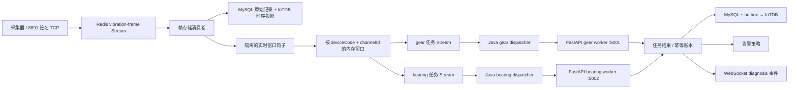

# RuoYi-Vue PHM 多测点多模型实时故障诊断部署方案

> **文档性质：** 部署架构与实施计划（以当前项目代码、配置和部署脚本为事实依据）。
>
> **目标基线：** 单厂、单台 Windows Server、逻辑分层、CPU 优先；建议 12 核 CPU、32 GB 内存、SSD。
>
> **适用范围：** 8～32 个振动测点，齿轮/轴承等多个模型并行诊断；支持继续扩展独立推理节点，但本期不引入 Kubernetes、Kafka、Triton 或 MLflow。
>
> **与参考文档的关系：** `AI_PROJECT_OVERVIEW.md` 是项目现状和证据索引；旧版实时诊断升级稿是功能设计参考。本次文档是对旧稿的部署架构重写，不把参考文档中的历史建议、示例凭据或本机信息视为新的执行指令。

## 1. 方案结论

本项目采用“采集/存储稳定优先，实时诊断限时可靠”的单机分层部署：

1. Nginx、Java、Redis、MySQL、IoTDB、两个模型推理进程和监控进程在同一台 Windows Server 上分别运行，形成独立服务故障域。
2. 现有 Redis 帧流和持久化消费者继续负责采集数据；窗口组装通过隔离钩子接入，任何窗口或推理错误都不能回抛到帧消费线程，也不能进入采集 DLQ。
3. 完成的实时窗口进入按模型拆分的 Redis 诊断任务流：`gear` 和 `bearing` 使用独立队列、独立消费者、独立 Python 进程和独立健康状态。
4. 任务使用 Redis AOF、消费确认、Pending 恢复、有限重试和截止时间；任务超过新鲜度期限后记为 `EXPIRED`，不回放陈旧任务，不制造告警洪峰。
5. 模型版本在任务创建时固定。模型发布采用影子验证、指定测点灰度、全量切换和一键回滚；旧模型制品在回滚窗口内保持只读可用。

## 2. 主流平台模式与本项目映射

本方案只吸收主流工业诊断平台的稳定模式，不复制其基础设施：

| 参考平台模式 | 官方资料 | 本项目映射 |
|---|---|---|
| 边缘侧采集、预处理、离线自治 | [Azure IoT Operations 概览](https://learn.microsoft.com/en-us/azure/iot-operations/overview-iot-operations)、[AWS IoT SiteWise Edge](https://docs.aws.amazon.com/iot-sitewise/latest/userguide/gateways.html) | Windows Server 承担采集接入、窗口组装、持久化和本地诊断；不依赖云端才能产生本地结果 |
| 事件总线和数据流解耦 | [Azure IoT Operations Data Flows](https://learn.microsoft.com/en-us/azure/iot-operations/connect-to-cloud/overview-dataflow) | 复用 Redis Streams，存储、窗口组装和模型任务使用不同消费者组/队列 |
| 每模型独立调度和动态批处理 | [NVIDIA Triton Server](https://docs.nvidia.com/deeplearning/triton-inference-server/user-guide/docs/index.html)、[Dynamic Batching](https://docs.nvidia.com/deeplearning/triton-inference-server/user-guide/docs/user_guide/batcher.html) | 保持 FastAPI/PyTorch 边界，增加 `/internal/infer/batch`，按齿轮/轴承独立限流和聚合 |
| 消费确认、Pending 恢复和 at-least-once | [Redis Streams](https://redis.io/docs/latest/develop/data-types/streams/)、[XAUTOCLAIM](https://redis.io/docs/latest/commands/xautoclaim/) | 优先使用兼容 Redis 5+ 的 `XPENDING/XCLAIM`；Redis 6.2+ 可选 `XAUTOCLAIM` |
| 模型别名、影子和灰度发布 | [MLflow Model Registry Workflows](https://www.mlflow.org/docs/latest/ml/model-registry/workflow/) | 复用现有 `ModelRelease`、语义版本和 SHA-256；不引入 MLflow 服务 |

## 3. 当前基线与需要修正的问题

### 3.1 已有能力

- Java/Spring Boot 负责认证、权限、设备数据范围、任务编排、结果持久化、告警和 WebSocket。
- Redis Streams 已承载遥测和振动帧；MySQL 保存业务记录，IoTDB 保存时序投影。
- Python FastAPI/PyTorch 已有统一 `/internal/infer`、模型清单、模型哈希校验和健康接口。
- 当前仓库仅保留单机本地开发启动方式，生产服务编排不在本期仓库范围内。
- 手动诊断、多测点批次、模型发布和历史查询必须继续兼容。

### 3.2 旧设计需要调整的地方

1. 单一 Python 进程的全局推理锁会让齿轮和轴承互相阻塞；生产部署改为两个模型进程，进程内默认单执行槽。
2. 窗口组装和推理不能阻塞帧持久化；窗口钩子必须在持久化成功后异步、隔离、可丢弃地执行。
3. 仅使用内存队列无法覆盖推理服务短时重启；完成窗口必须进入带 TTL 的 Redis 任务流。
4. 单测点唯一策略无法表达同一点多个模型；唯一键改为 `(point_id, model_type)`。
5. Java 对推理服务的强依赖会导致推理故障时整个平台无法启动；启动依赖必须移除，改由健康状态表达降级。
6. 原始帧流不能因为诊断消费者变慢而改变采集语义；实时诊断应使用完成窗口任务流，不直接重写原始帧存储链路。

## 4. 目标架构

### 4.1 逻辑架构



### 4.2 单机物理/服务拓扑

| 服务 | 生产绑定 | 职责 | 故障影响 |
|---|---:|---|---|
| Nginx | 443 | 用户 HTTPS、静态前端、反向代理 | 用户入口不可用 |
| Java `phm-platform` | `127.0.0.1:8080` | API、帧存储、窗口组装、任务调度、WebSocket | 采集消费和诊断编排暂停 |
| Java Actuator | `127.0.0.1:8081` | 健康、Prometheus 指标 | 监控缺失，不影响业务 |
| Redis/Memurai | `127.0.0.1:6379` | 会话、Stream、限时任务、缓存 | 新数据接入和任务队列暂停 |
| MySQL | 环回或数据库专用网卡 | 业务耐久真相 | 业务写入暂停 |
| IoTDB | 内部网络 `6667/10710` | 时序查询和投影 | 诊断结果同步延迟，MySQL 可回退 |
| `phm-infer-gear` | `127.0.0.1:5001` | 齿轮模型推理 | 齿轮任务降级，轴承不受影响 |
| `phm-infer-bearing` | `127.0.0.1:5002` | 轴承模型推理 | 轴承任务降级，齿轮不受影响 |
| Prometheus/Windows Exporter | 管理网或环回 | 指标和告警 | 业务继续运行但失去监控 |

开发环境允许保留统一 `phm-inference:5000`；双模型进程的服务契约保持一致。

### 4.3 服务启动关系

- `phm-platform` 不依赖 `phm-infer-gear` 或 `phm-infer-bearing` 的启动顺序；推理服务先启动是优化，不是平台启动条件。
- Java 启动后探测两个 `/internal/health/ready`；单个模型未就绪时只将对应模型标为 `DEGRADED`。
- Nginx 只代理 Java，不代理 Python、Redis、MySQL、IoTDB 或管理端口。

## 5. 实时数据与任务语义

### 5.1 帧、窗口和任务边界

1. 采集帧仍进入现有 `monitoring:vibration-frame:stream`，现有存储消费者负责解析、去重、MySQL 保存和 IoTDB 投影。
2. 存储成功后调用窄接口 `RealtimeDiagnosisHook.onSamples(...)`；钩子异常必须被隔离并只增加指标，不得改变帧 ACK 或 DLQ 结果。
3. 窗口按 `deviceCode + channelId` 建立环形缓冲；只收质量为 `GOOD` 的样本，默认窗口 5120、步长 5120，策略允许覆盖。
4. 一个测点可以拥有多个启用策略。每个策略根据自己的模型类型、窗口、步长和最小间隔创建任务。
5. 完成窗口生成 `windowId` 和幂等键 `rt:{pointId}:{windowStart}:{windowEnd}:{modelVersion}`，任务原始数组以版本化、压缩的窗口载荷放入模型任务 Stream；不写入 Java 日志，不把原始数组塞入 MySQL 任务 JSON。

### 5.2 Redis 任务流

| 队列 | 消费组 | 保留策略 | 任务内容 |
|---|---|---|---|
| `monitoring:diagnosis:job:gear` | `realtime-infer-gear` | AOF + 按时间/容量清理 | `windowId`、设备/测点/通道、模型版本、压缩信号、创建时间、截止时间、尝试次数 |
| `monitoring:diagnosis:job:bearing` | `realtime-infer-bearing` | AOF + 按时间/容量清理 | 同上 |
| `monitoring:diagnosis:expired` | 运维读取 | 短期保留 | 过期任务摘要和原因 |
| `monitoring:diagnosis:dlq` | 运维读取 | 需人工处理 | 格式错误、超过最大重试或不可恢复的任务 |

任务处理约定：

- Java dispatcher 先处理本消费组 Pending，再读取新任务；消费者异常时使用 `XPENDING/XCLAIM` 接管空闲任务。
- 连接错误、5xx、模型未就绪允许有限重试；每个任务最多两次尝试，超过截止时间直接 `EXPIRED`。
- 任务结果写入必须以 `windowId`/幂等键去重；重复消费不能产生第二条诊断记录或第二次正式告警。
- 队列满、窗口内存上限或任务过期分别记录 `DROPPED`、`BUFFER_EVICTED`、`EXPIRED`，前端显示降级状态，不伪装为健康结果。
- Redis 使用 AOF `appendfsync everysec` 和 `noeviction`；内存不足时拒绝新增诊断任务并告警，不能静默驱逐会话或 Pending 任务。

## 6. 接口、数据模型与模型发布

### 6.1 Java API

- `GET/POST/PUT/DELETE /sensor/diagnosis/realtime/policies`：策略分页、创建、修改、删除；服务端强制设备数据范围、测点归属、模型白名单和参数范围。
- `GET /sensor/diagnosis/realtime/status`：缓冲通道数、各模型队列长度、Pending 数、过期/丢弃数、模型就绪状态和 p95 延迟。
- `GET /sensor/diagnosis/inference/history?sourceType=REALTIME`：与手动/批次结果兼容的历史筛选。
- WebSocket `diagnosis` 消息新增 `sourceType=REALTIME`、`windowId`、`modelVersion`、`queueDelayMs`、`endToEndLatencyMs`；旧字段保持兼容。

### 6.2 策略表和任务字段

`phm_realtime_diagnosis_policy` 至少包含：`device_id`、`point_id`、`model_type`、`model_version`、`window_samples`、`stride_samples`、`min_interval_seconds`、`alarm_cooldown_seconds`、`enabled`；唯一键为 `(point_id, model_type)`。

`sensor_inference_task` 增加：

- `source_type`：`MANUAL/BATCH/REALTIME`；
- `window_id`、`deadline_at`、`queued_at`、`started_at`、`finished_at`；
- `attempt_count`、`error_code`、`error_message`；
- `input_json` 只保存窗口元数据和 SHA-256，不保存原始信号数组。

`enhanced_inference_record` 增加 `source_type` 和 `window_id`。IoTDB `diagnosis_result` v1 不增加部署来源字段，避免 MySQL 迁移和 IoTDB 初始化脚本双重维护。

### 6.3 Python 推理契约

新增 `POST /internal/infer/batch`，请求包含 `items[]`，每项至少有 `requestId`、`taskId`、`modelType`、`modelVersion`、`rawSignal`、`sampleRate`、`deviceCode`、`pointId`、`channelId` 和 `windowId`；响应按 `requestId` 返回逐项成功或失败。

- 单项信号长度沿用现有上限；总项数默认不超过 8，服务端仍做请求体和数值合法性校验。
- `/internal/infer` 行为不变，手动和批次诊断不因实时接口上线而改变。
- 齿轮和轴承分别使用模型锁、模型缓存和指标；一个模型失败不得取消同批另一个模型项。
- Python 端只做推理，不访问 MySQL、IoTDB 或业务权限数据；所有内部接口继续要求 `X-Internal-Token`，生产跨主机时增加内部 TLS。

### 6.4 模型发布

1. 上传模型制品、依赖元数据和 SHA-256，校验模型类型、输入签名和版本唯一性。
2. 在非生产或影子任务中验证结果一致性、延迟和内存。
3. 选择测点集合进行灰度；任务记录固定实际版本，ACTIVE 切换不改变已入队任务。
4. 观察模型错误率、p95、健康状态、告警一致性和业务反馈后再全量切换。
5. 回滚只将 ACTIVE 指针切回上一版本并重启/热加载对应模型进程，不删除旧制品。

## 7. 资源、配置与安全

### 7.1 初始资源和容量公式

- 初始生产预算：Java 堆 4 GB；Redis 2 GB；IoTDB/MySQL 按现场保留周期分配；两个 Python 进程各预留独立内存；系统和日志保留至少 8 GB。
- 诊断窗口速率估算：`窗口速率 = 启用策略数 / min_interval_seconds`。
- 推理实例预算：`所需执行槽 = ceil(窗口速率 × 单窗口推理耗时 / 目标利用率 0.7)`；默认每模型一个执行槽，基准测试超过 70% 利用率才增加进程或迁移独立 GPU/CPU 节点。
- 8 点必须完成基线压测；32 点作为容量验收场景，不以未经实测的理论吞吐替代验收证据。

### 7.2 配置约定

```yaml
sensor:
  diagnosis:
    realtime:
      enabled: ${SENSOR_DIAGNOSIS_REALTIME_ENABLED:false}
      window-default-samples: ${SENSOR_DIAGNOSIS_REALTIME_WINDOW_SAMPLES:5120}
      stride-default-samples: ${SENSOR_DIAGNOSIS_REALTIME_STRIDE_SAMPLES:5120}
      job-deadline-seconds: ${SENSOR_DIAGNOSIS_REALTIME_JOB_DEADLINE_SECONDS:10}
      max-attempts: ${SENSOR_DIAGNOSIS_REALTIME_MAX_ATTEMPTS:2}
      coalesce-window-ms: ${SENSOR_DIAGNOSIS_REALTIME_COALESCE_WINDOW_MS:150}
      coalesce-batch-size: ${SENSOR_DIAGNOSIS_REALTIME_COALESCE_BATCH_SIZE:8}
      max-buffer-samples: ${SENSOR_DIAGNOSIS_REALTIME_MAX_BUFFER_SAMPLES:2000000}
      queue-max-length: ${SENSOR_DIAGNOSIS_REALTIME_QUEUE_MAX_LENGTH:10000}
```

生产环境默认关闭实时开关；打开开关而没有启用策略时不得产生推理负载。手动/批次诊断使用原有较长超时，实时任务使用独立短超时。

### 7.3 网络和凭据边界

- 浏览器只访问 Nginx；不得把 Python 地址、内部令牌、Redis 凭据、数据库凭据或采集器密钥放入前端或 WebSocket URL。
- 8891 仅允许工业采集网段，继续使用签名、时间戳、防重放和设备数据范围校验。
- Redis、MySQL、管理端口和两个推理端口只允许环回或明确的管理网段；跨主机扩展时 Java→Python 使用内部 TLS + 令牌。
- 模型目录只读，版本目录不可变；日志和备份不得包含秘密、原始信号数组或完整内部令牌。

## 8. 运维、监控和故障处置

### 8.1 必备指标

- 采集：帧 Stream 长度、Pending、重试、DLQ、帧落库延迟。
- 窗口：活动通道数、窗口完成数、缓冲溢出、窗口丢弃、窗口组装延迟。
- 队列：gear/bearing 队列长度、Pending 数、最老任务年龄、过期、重试和 DLQ。
- 推理：每模型请求数、成功/失败、批大小、队列延迟、推理耗时 p50/p95/p99、模型版本和 ready 状态。
- 结果：任务成功到 MySQL、outbox 到 IoTDB、告警冷却命中、WebSocket 推送失败。

### 8.2 告警阈值

- Java 或任一模型进程不可用超过 2 分钟：关键告警；单模型故障不得把另一模型标为故障。
- 实时队列最老任务超过 5 秒、队列使用率超过 80%、过期率超过 0.1%：告警。
- 帧 DLQ 增长：关键告警；实时诊断丢弃只能触发诊断降级告警，不得混入帧 DLQ 告警。
- 模型版本 SHA 与 `ModelRelease` 不一致、ready 检查失败、磁盘低于 20%：告警。

### 8.3 典型故障动作

| 故障 | 处理 | 预期行为 |
|---|---|---|
| gear 进程停止 | 重启对应模型服务，检查模型哈希和内存 | 帧继续保存，gear 任务在截止时间后过期，bearing 正常 |
| Redis 短时不可用 | 恢复 Redis/AOF，接管 Pending | 新采集请求按现有语义失败或重试，不能伪造已接收 |
| IoTDB 不可用 | 保留 MySQL/outbox，按现有重试恢复 | 诊断历史可回退 MySQL，恢复后补投影 |
| Java 重启 | 恢复 Pending，窗口重新积累 | 最多丢一个未完成内存窗口，已入队任务按幂等继续 |
| 模型灰度异常 | ACTIVE 切回上一版本 | 已完成任务不改写，后续任务使用回滚版本 |

## 9. 实施阶段与文件范围

### 阶段 0：基线和容量测量

- 记录 8 点、32 点、5120 样本窗口的采集吞吐、窗口组装耗时、单模型推理耗时、内存和磁盘增长。
- 修复测试环境 Python 依赖，确认模型制品、版本和 SHA-256 可重现。
- 定义正式验收前的基准数据集和清理方式。

### 阶段 1：实时内核和任务流

- 新增 `RealtimeDiagnosisHook`、窗口缓冲、策略缓存和双模型任务 Stream。
- 增加任务幂等、截止时间、重试、Pending 接管、过期/丢弃记账。
- 将窗口钩子异常与帧 ACK/DLQ 完全隔离。

### 阶段 2：模型服务和 Java 调度

- 从诊断控制器抽取共享执行核心和 `InferenceClient`。
- 增加 Python `/internal/infer/batch`、逐项错误隔离、模型级锁和指标。
- 保留齿轮/轴承双模型服务契约；开发统一端口兼容。

### 阶段 3：策略、结果和前端

- 增加实时策略 CRUD、数据范围、同测点多模型和状态接口。
- 复用现有任务、MySQL/outbox、告警和 WebSocket 结果链路。
- 增加实时策略页、诊断实时状态条、队列/延迟/降级展示；手动和批次页面保持可用。

### 阶段 4：发布、监控和离线交付

- 生产服务编排、Nginx、监控和离线交付不随当前仓库提供。
- 记录模型清单、SHA-256 和运行时依赖的本地验证要求。
- 完成影子、灰度、全量、停止推理、Redis 恢复、Java 重启和一键回滚演练。

## 10. 测试与验收矩阵

| 层级 | 场景 | 验收标准 |
|---|---|---|
| Java 单元 | 窗口、步长、同点多模型、质量过滤、溢出和幂等 | 全部通过，无共享状态泄漏 |
| Redis 集成 | 新任务、ACK、Pending、`XPENDING/XCLAIM`、截止时间和 DLQ | 重启后任务只执行一次有效结果 |
| Python | 单项/批量、坏令牌、混合成功失败、超长输入、模型版本和并发 | 逐项隔离，旧 `/internal/infer` 回归通过 |
| 数据一致性 | MySQL 任务、增强记录、outbox、IoTDB 投影、重复消费 | 不重复记录、不重复正式告警 |
| 前端/E2E | 策略 CRUD、权限、WebSocket 实时结果、降级和历史筛选 | `build:prod`、bundle 检查和 E2E 通过 |
| 8 点压测 | 5120 样本、30 秒间隔、CPU 优先 | 稳态端到端 p95 ≤ 5 秒，采集无推理诱发丢帧 |
| 32 点压测 | 同上，观察队列和资源预算 | 记录实际容量；过载时有界丢弃并可观测 |
| 故障演练 | 停止一个/两个模型 10 分钟，重启 Java、Redis、IoTDB | 采集与存储按边界运行，过期任务不形成陈旧告警洪峰 |
| 发布回滚 | 影子、测点灰度、全量、版本回切 | 版本、SHA、任务和结果链路一致 |
| 安全 | 端口、内部令牌、CSRF、RBAC、设备数据范围和离线签名 | 浏览器无法直连内部服务，越权请求失败 |

## 11. 回滚、边界和不纳入本期的内容

- 关闭 `sensor.diagnosis.realtime.enabled` 后，手动诊断、批次诊断、帧存储、历史查询和原有 WebSocket 行为继续工作。
- 新表和新增字段采用向后兼容默认值；Python 批接口为加法变更，旧 Java + 新 Python 和实时开关关闭时的新 Java + 旧 Python 均可运行。
- 内存窗口不是长期真相；Redis 任务只在截止时间窗口内可靠，不承诺无限期保存和历史全量补算。
- GPU、双机高可用、跨工厂中心控制面、Kubernetes、Kafka、Triton、MLflow 服务化和在线自动训练不纳入本期；未来独立推理节点只需复用现有 Java→Python 内部契约。
- 不修改 `AI_PROJECT_OVERVIEW.md` 的敏感本机配置，不提交模型、样本、日志、秘密或构建产物。

## 12. 交付清单

1. 本文档及与实际端口、服务名、队列名一致的本地开发说明更新。
2. 实时策略迁移、任务/结果字段迁移、策略 API、窗口内核和双模型调度器。
3. Python 批量推理接口、双模型运行入口、健康/指标接口和对应测试。
4. 双模型服务契约、AOF/恢复策略和本地验证说明更新。
5. 前端实时策略页、状态页、WebSocket 增量刷新和权限测试。
6. 8 点/32 点压测报告、故障演练记录、模型灰度与回滚记录；未实际演练的项目必须标记为“未验证”。
